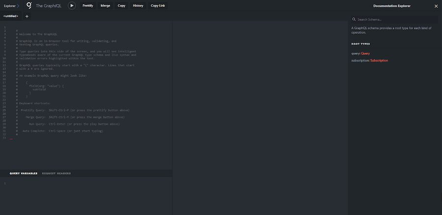
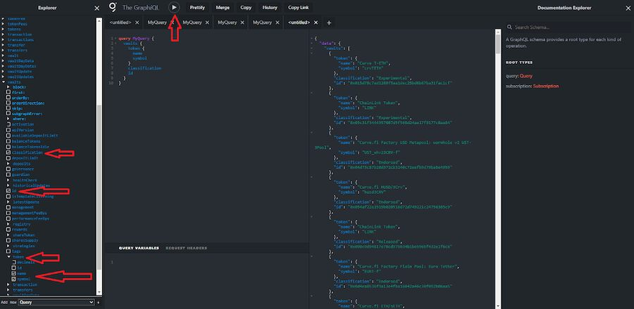
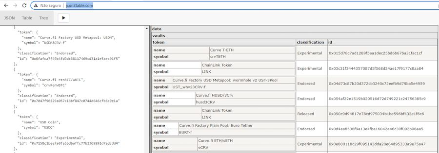
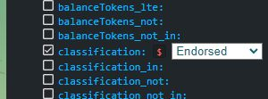

A Subgraph is a service that allows developers and users to query blockchain data using well-known database query languages. In this article, we will explore a [Yearn Ethereum Subgraph](https://api.thegraph.com/subgraphs/name/rareweasel/yearn-vaults-v2-subgraph-mainnet/graphql) and learn how to ask it for data (a.k.a. query it). This knowledge is extremely important for web3 developers, but any blockchain user may also leverage information found on public subgraphs for their interests.

Luckily for us, today we have services like [The Graph](https://thegraph.com/en/) which provides a human-friendly interface for communicating with subgraphs and also the entire. It’s worth noting that The Graph is a complex protocol that maintains an ecosystem of incentives for many roles that co-exist to make the infrastructure keep on going

\
*Things you can do at The Graph*

Before diving into a subgraph let’s be clear about why we need one and what it solves: The blockchain is an ever-growing chain of blocks and each block has a small piece of information inside it, when we need to query for something that needs data from many blocks we need to read through them all and aggregate the data, turns out this can get super complex and hard to maintain (to read more on this search for “Event Sourcing”). We already have solutions to deal with querying data called “Databases“, so the subgraph will maintain a Database that we can query for data in a much more human-friendly way to do it.

\
*Overview of what the subgraph solves*

Now that we know what a subgraph is, let’s interact with one: Head to the [**Yearn Vaults V2 Subgraph Mainnet** at The Graph](https://api.thegraph.com/subgraphs/name/rareweasel/yearn-vaults-v2-subgraph-mainnet/graphql) and you should be greeted with this screen:

\
*[https://api.thegraph.com/subgraphs/name/rareweasel/yearn-vaults-v2-subgraph-mainnet/graphql](https://api.thegraph.com/subgraphs/name/rareweasel/yearn-vaults-v2-subgraph-mainnet/graphql)*

On the top left corner click "Explorer" to open the left-side tab with many entities that we can query for:

\
*Open explorer tab*

Now you are free to click on the entities on the left-side bar to add them to your query. When you click on one of them it will expand all the fields you can query for.

Let’s start by clicking on "vaults" and selecting a few fields to query for. I’ve marked with red arrows everything I clicked. Clicking will automatically fill up the "query" field for you and you can press the "Play" button to run the query and see the results on the right. In this example, we listed all Yearn vaults for their addresses and deposit tokens:

\
*Click stuff and see what happens!*

The result that came out in a format called JSON. This format is a standard way to structure data in the web and there are tons of ways to consume and transform this data. For a more readable table-like view paste the result into an app like [json2table](http://json2table.com/):

\
*Table-like format for the query output at json2table.com*

We can filter things and use any of the [GraphQL](https://graphql.org/) features to make queries the way you want. The clickable interface helps a lot too by providing filters. All fields contain the following filters:

- **First**: Limits the total number of results in a query to the first X results
- **OrderBy / OrderDirection**: Helps you order the results the way you want
- **Skip**: Skip the first X results. For example, if you ask for the First 10 but Skip 10 you would get results from 11 to 20.
- **Where**: Opens a list with all properties and you can filter for results that have specific properties you want

Let’s fiddle with "Where" a bit to query for only "Endorsed" vaults: Click the "where" filter in vaults:

Select the "classification" property inside "where" and choose the Endorsed field

Now we only query for production vaults in our results:

Here is another example query where we can see all harvests that happen inside vault strategies and how much they profited:

There are no limits to what you can do with the subgraph, in fact all recent yearn apps use it a lot since it makes for a much better developer experience and quicker solution for most problems that need data from the blockchain. I hope this walkthrough inspired you to dig deeper into what you can query for in subgraphs, and I recommend that you take a deeper look into [GraphQL](https://graphql.org/) to learn all query tricks.

For programmers, you can use GraphQL in your favorite programming language and build web3 applications along with something like [ethers-io](https://github.com/ethers-io/ethers.js) (library to help sign transactions in the blockchain).
