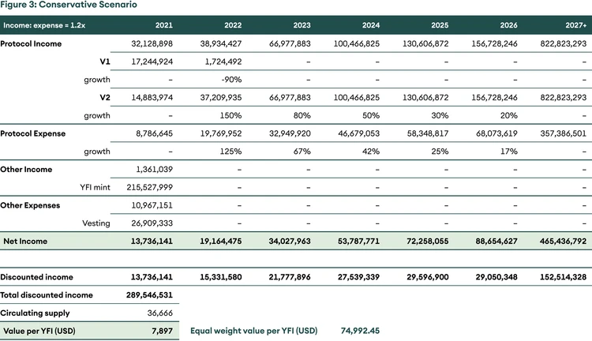
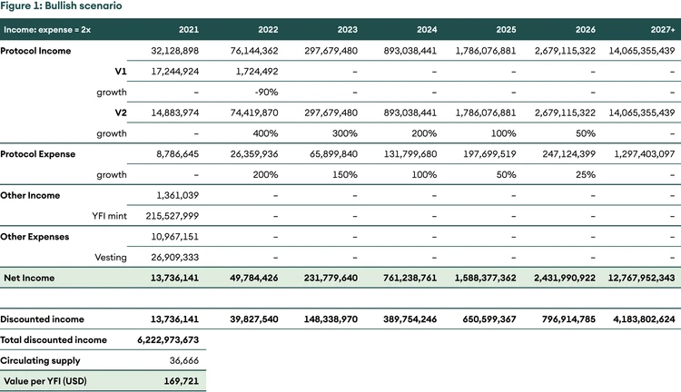

## Yearn Finance: gestión de activos descentralizada

Resumen

_En esta edición de Digital Investor, cubrimos el protocolo de gestión de activos descentralizado más grande, Yearn Finance. Cubrimos su lanzamiento justo, los impulsores de valor para el token, su foso y las actualizaciones significativas del protocolo. Finalmente, intentamos encontrar un valor justo para el token usando DCF._

## Introducción

Yearn Finance es un protocolo de finanzas descentralizadas (DeFi) que fue pionero en la gestión de activos para obtener rendimiento de forma pasiva en activos estables y riesgosos. Uno puede pensar en él como un administrador de activos automatizado que asigna los fondos de los depositantes a las mejores estrategias de generación de rendimiento para obtener los rendimientos más altos.

Lo que comenzó como un simple producto generador de rendimiento llamado iEarn de Andre Cronje se transformó en un edificio financiero construido sobre la base de los contratos inteligentes. iEarn era un producto simple que prestaría activos a través del protocolo de generación de intereses más alto entre Compound, Aave y dYdX. Sin embargo, Yearn Finance hace mucho más que simplemente asignar fondos a diferentes cuentas de ahorro de monedas estables.

Yearn Finance ofrece una amplia gama de productos, siendo los más relevantes las bóvedas. Las bóvedas son agregadores de estrategias dinámicas que asignan fondos a varias estrategias que brindan el mejor rendimiento para los depositantes en su activo de elección (en lugar de solo una moneda estable), lo que permite a los usuarios obtener un rendimiento mientras mantienen la exposición a su activo preferido.

### Antecedentes

Yearn lanzó su token de gobernanza YFI a mediados de julio de 2020 y se promociona como una de las distribuciones de tokens más justas en el espacio. Los tokens YFI se otorgaron a proveedores de liquidez de grupos específicos de Curve y Balancer que habían apostado su liquidez en el protocolo. Al principio, solo se acuñaron 30 000 YFI y se distribuyeron por completo a todos los interesados. La comunidad aprobó la Propuesta 0, que permitió acuñar más YFI para crear incentivos continuos para proveedores de liquidez, desarrolladores y contribuyentes.

Con un suministro limitado y un alto uso, el precio de YFI se disparó de USD 32 a un máximo de aproximadamente USD 43 000 dentro de un par de meses del lanzamiento a pesar de la afirmación del fundador de que no tiene valor financiero. Sin embargo, creemos que el [token de gobierno](https://www.seba.swiss/research/governance-tokens-coordinating-the-human-element/), YFI, debe tener un valor significativo para que la plataforma funcione bien como los tenedores de tokens deciden el resultado para los depositantes. En el momento de escribir este artículo, Yearn Finance tiene un valor bloqueado de 3800 millones de USD, de los cuales aproximadamente el [78 % está bloqueado](https://yearn.science/) en las bóvedas.

### ¿Por qué YFI debería tener un valor distinto de cero?

No todos los tokens de gobernanza son iguales. YFI permite a los titulares votar estrategias para diferentes bóvedas, cambiar la estructura de tarifas, acuñar nuevas monedas y distribuir recompensas a los contribuyentes. Los poseedores de fichas también controlan la tesorería del protocolo de alrededor de USD 600 millones. Un precio distinto de cero significa que quienes toman decisiones de gobernanza tienen algo que perder en caso de que se tome una mala decisión. En consecuencia, se incentiva a los poseedores de tokens a tomar buenas decisiones que aumenten el atractivo de las estrategias y aumenten los ingresos por protocolo y los activos bajo gestión.

## Defensibilidad de Yearn

Los proyectos de código abierto se pueden bifurcar. ¿Cuál es la defensa de Yearn en este caso? Uno de los fosos principales de Yearn es que comparte el botín con los escritores de estrategia. Según la YIP-52 (Propuesta de mejora de Yearn), Yearn convirtió a los estrategas de bóveda en socios iguales en la estrategia. Las bóvedas de Yearn cobran una tarifa de mantenimiento anual del 2% y una tarifa de rendimiento del 20% de los depositantes. Antes de YIP-52, el estratega ganaba solo el 0,5% de la tarifa de rendimiento, el 19,5% se destinaba a la tesorería del protocolo. Después de que se aprobó YIP-52, la ganancia se divide en partes iguales entre el estratega y la tesorería. Si la bóveda es considerable, una buena estrategia puede generar ganancias sustanciales para su escritor. Yearn tiene el AuM más alto de cualquier administrador de activos descentralizado y, por lo tanto, brinda el mayor incentivo para que los mejores escritores de estrategias compartan su estrategia solo con él. Esto crea un círculo virtuoso de mejores rendimientos, mayores activos bajo gestión y mejores estrategas.

En segundo lugar, aunque irónico, la confianza es un aspecto esencial del aumento de los efectos de red. Como se ha visto en algunas bifurcaciones de Binance Smart Chain de proyectos de Ethereum, es más probable que haya hacks y exploits si el equipo ha bifurcado el proyecto y no lo comprende en profundidad. El equipo de Yearn es pionero en el espacio y ha demostrado que puede adaptarse a un entorno cambiante. Cuando los rendimientos cayeron, cambiaron las estrategias de las bóvedas para aumentarlos. Cuando no se estaban desarrollando nuevas estrategias, el gobierno tomó una llamada para aumentar las recompensas de los estrategas. La adaptabilidad apunta hacia la capacidad del equipo para cumplir a largo plazo, mientras que las horquillas pueden tener una vida útil más corta.

### Pero, ¿el rendimiento es una característica constante de Yearn?

Una pregunta obvia es si los rendimientos dentro de los criptoactivos son constantes. Afortunadamente, las finanzas tradicionales no han puesto el listón demasiado alto, con tasas de interés cercanas al 0 por ciento en el mundo desarrollado. Creemos que los rendimientos dentro del ecosistema de criptoactivos seguirán ciclos. Un mayor rendimiento atrae a más usuarios, lo que aumenta las tarifas. Las tarifas más altas desalientan a los pequeños inversores y, por lo tanto, el rendimiento [cae](https://www.seba.swiss/research/yearn-finance-decentralised-asset-management/#1)[^1]. A medida que los inversores más pequeños dejan de interactuar con la cadena de bloques, las tarifas caen. El próximo ciclo de aumento de precios combinado con tarifas más bajas nuevamente alienta a los inversores más pequeños a participar, y el ciclo se repite. Nuestro [inversor digital anterior](https://www.seba.swiss/research/defi-investment-strategies-a-performance-review) explica esta hipótesis.

Aunque los precios de los tokens DeFi se vieron afectados por el reciente colapso de las criptomonedas, la cantidad de tokens bloqueados en varios protocolos DeFi fue casi constante. Cada vez más bitcoins y monedas estables quieren estar en la cadena de bloques de Ethereum en busca de rendimiento. Creemos que DeFi aún tiene un largo camino por recorrer.

## Tesis de inversión

### De abajo hacia arriba

El auge de DeFi permite a los titulares beneficiarse no solo de los aumentos de precios, sino también de obtener ingresos pasivos en varios activos. Yearn facilita esto último. Aunque los titulares pueden obtener este rendimiento de forma independiente sin Yearn, el protocolo ofrece algunos beneficios. En primer lugar, es más seguro que el titular promedio moviendo sus propios fondos. DeFi es un salvaje oeste, incluso aquellos que entienden los aspectos técnicos han sido víctimas de hacks y exploits. Un usuario promedio no puede auditar contratos inteligentes y desplegar fondos en un entorno dinámico. El equipo de Yearn tiene una gran experiencia y comprende las trampas mejor que sus usuarios y, por lo tanto, está en condiciones de proporcionar mejores rendimientos ajustados al riesgo. En segundo lugar, sabemos que los precios de la gasolina pueden ser muy altos. Los pequeños inversionistas (&lt;USD 10,000) están descontados y no pueden mantenerse al día con la actividad de agricultura de rendimiento. Yearn ofrece la opción de juntar los fondos y así subsidiar los costos del gas.

YFI se beneficia directamente de las ganancias de la plataforma. El protocolo cobra una tarifa de gestión del 2% y una tarifa de rendimiento del 20%. La totalidad de las tarifas de gestión y el 50% de las tarifas de rendimiento se acumulan en la tesorería controlada por los tenedores de tokens. Neto de gastos, las ganancias del protocolo se utilizan para recomprar YFI del mercado abierto (ver YIP-56 a continuación). Con un número limitado de YFI, TVL en crecimiento y una presión de compra constante por parte de la tesorería, es probable que la tokenómica actúe como un fuerte impulsor del precio.

### De arriba hacia abajo: el entorno macro anhela un producto como Yearn Finance
 
La mayor parte del mundo desarrollado está envejeciendo. [Los baby boomers](https://www.seba.swiss/research/yearn-finance-decentralised-asset-management/#2)[^2]se jubilarán en los próximos años y las pensiones se convertirán en un aspecto esencial de sus vidas. A diferencia de la generación anterior a los baby boomers, las condiciones actuales para la jubilación son diferentes. En primer lugar, dado que la esperanza de vida ha aumentado, es probable que los jubilados de 60 años vivan 25 años más, dependiendo en gran medida de sus pensiones. En segundo lugar, cuando la generación anterior se jubiló, los tipos de interés rondaban el 18%, favoreciendo a los ahorradores. Actualmente, las tasas de interés están cerca de 0, lo que no incentiva el ahorro. La combinación de una gran población que llega a la jubilación y tasas de interés cercanas a cero es una mala combinación. La mayor parte del mundo desarrollado enfrenta (o enfrentará) este problema.

Bitcoin ha sido el abanderado de la industria de los criptoactivos. Sin embargo, 2020 ha demostrado que las monedas estables también son uno de los aspectos emocionantes de la revolución de los activos digitales. Con las monedas estables viene la oportunidad de obtener un rendimiento en dólares. Es una oportunidad emocionante no solo para los nativos de las criptomonedas, sino también para los fondos sofisticados en los que el mandato sería obtener alrededor del 6-8 % de rendimiento anual en alguna parte de su cartera. Los fondos de pensiones actualmente tienen alrededor de [32 trillones de USD](https://www.oecd.org/pensions/Pension-Funds-in-Figures-2020.pdf) (solo EE. UU. tiene alrededor de 18,8 trillones de USD) en activos. Vivimos en un mundo en el que la deuda total con rendimiento negativo ha superado los [17 trillones de USD](https://www.ft.com/content/378acc52-b1a5-4d58-8a87-8ea052b2c610), y empresas públicas como Microstrategy y Tesla está eligiendo bitcoin como activo de reserva.

Si bien puede ser demasiado pronto para los fondos de pensiones, los fondos e individuos más aventureros podrían verse tentados a probar plataformas construidas sobre Ethereum para escapar de sus entornos de rendimiento negativo. A medida que las finanzas tradicionales y las finanzas descentralizadas se integren más, Yearn Finance estará bien posicionado para reclamar una parte significativa del capital como líder en el espacio de gestión de activos descentralizados.

## Gobernanza y cambios significativos en el protocolo

Yearn Finance es uno de los protocolos más activos en lo que a gobernanza se refiere. En general, las propuestas se discuten primero en el foro de gobernanza y luego pasan a la votación en cadena en forma de YIP (Propuesta de mejora de año). Yearn también es el primer protocolo DeFi en proporcionar [informe de ganancias trimestrales](https://github.com/yearn/yearn-pm/blob/master/financials/reports/2021Q1-yearn-quarterly-report.pdf) regularmente. Creemos que esto debería convertirse en la norma en el espacio DeFi.

### Cambio en la oferta de YFI (Propuesta 0 y YIP-57)

La primera propuesta fue cambiar el suministro de YFI. YFI había comenzado con uno de los lanzamientos más justos y la comunidad decidió acuñar más tokens más adelante. Recientemente, según [YIP-57](https://gov.yearn.finance/t/yip-57-funding-yearns-future/9319), se acuñaron 6666 nuevos tokens YFI para respaldar el desarrollo del protocolo. Permitió a Yearn extender los paquetes de adjudicación (2222 YFI) a los desarrolladores para alinear los incentivos. El resto de los tokens están en la tesorería para usarlos para el crecimiento del protocolo.

### Cambiar la estructura de tarifas de la bóveda (YIP-51)

Las bóvedas de Yearn V1 tenían una estructura de tarifas diferente donde se cobraba cada retiro. [YIP-51](https://gov.yearn.finance/t/yip-51-set-vault-v2-fee-structure/7752) cambió la estructura de tarifas a un modelo 2/20, donde el protocolo cobra un 2% de comisión de mantenimiento y 20% de comisión de rendimiento.

### Hacer que los estrategas tengan piel en el juego (YIP-52)

De la comisión de rendimiento del 20 %, el 19,5 % se destinó a la tesorería, mientras que el 0,5 % se asignó al estratega de bóveda. Aprobación de la gobernanza de [YIP-52](https://gov.yearn.finance/t/yip-52-make-strategist-skin-in-game-partner-for-make-benefit-of-glorious-brain-of-yearn/7856) convirtió al estratega en un socio igualitario en el desempeño. La justificación de este cambio fue simple, la defensa de Yearn se basa en que los estrategas exploten las mejores oportunidades de rendimiento. Y el protocolo debe incentivar a los mejores estrategas para que hagan lo mismo.

### Recompra y construcción (YIP-56)

Cuando comenzó YFI, los titulares de YFI tuvieron que hacer staking de YFI en la bóveda de gobierno para reclamar una participación de los ingresos del protocolo. Con [YIP-56](https://gov.yearn.finance/t/yip-56-buyback-and-build/8929) en vigor, se retiró la bóveda de gobierno y el protocolo comenzó a distribuir ganancias mediante la recompra de YFI. del mercado. Simplificó el staking y la gobernanza y distribuyó las recompensas entre los poseedores de tokens. El YIP también hizo que las ganancias fueran más eficientes desde el punto de vista fiscal, ya que la revalorización del capital a través de recompras podría gravarse menos que los ingresos por dividendos a través de recompensas de participación. Otro subproducto de esta mejora fue hacer que YFI sea más eficiente, ya que los titulares pueden votar mientras usan YFI. Por ejemplo, los usuarios pueden poner YFI como garantía para acuñar DAI en Maker y obtener intereses sobre DAI utilizando otros protocolos DeFi.

## Valoración

Acumulativamente, Yearn ha generado más de USD 8 millones en recompensas desde agosto de 2020, de los cuales cerca de USD 5 millones se ganaron hasta abril de 2021, donde solo abril ascendió a USD 2,7 millones.

Valorar Yearn Finance es una tarea tediosa. Yearn funciona con varios otros protocolos, ya sea en forma de vínculos o simplemente usándolos. Algunas menciones dignas de mención son Curve, Sushiswap, Cream y Badger. La composición hace que sea difícil proyectar cómo puede resultar el crecimiento.

Suponemos tres escenarios: alcista, base y conservador. Los escenarios utilizan diferentes supuestos de crecimiento e ingresos por unidad de dólar gastado. Para el escenario alcista, el ingreso/gasto es 2x mientras que lo mismo para el caso base y el escenario conservador es 1.5x y 1.2x, respectivamente.

Utilizando una tasa de descuento del 25 %, una tasa de crecimiento terminal del 5 % y otorgando el mismo peso a los tres escenarios, llegamos a un valor justo de USD ~75 000 por YFI.

### Figura 1: escenario alcista

### Figura 2: Escenario de caso base

### Figura 3: Escenario conservador

## Riesgos

Al igual que todos los demás protocolos DeFi, Yearn es vulnerable al riesgo de contratos inteligentes. El riesgo idiosincrático para Yearn es que el rendimiento se extinga y se mantenga bajo durante mucho tiempo. El bajo rendimiento significa que no hay incentivos para que los inversores bloqueen fondos en Yearn. El bajo rendimiento podría ser típicamente un fenómeno de mercado bajista. Queda por ver cómo el equipo de Yearn aborda los largos períodos de bajos rendimientos. A pesar de la reciente caída de los precios y el sentimiento moderado, Yearn continúa ofreciendo rendimientos lucrativos en monedas estables y productos relacionados con curve.

## Conclusión

A pesar de que Yearn Finance es un protocolo de código abierto donde se pueden copiar estrategias, creemos que Yearn tiene una propuesta única: rotar fondos de forma pasiva para obtener rendimientos ajustados al alto riesgo a través de estrategas bien incentivados. Creemos que el equipo experimentado de Yearn Finance y su sólida comunidad son su foso. Tiene el TVL más alto entre los administradores de activos descentralizados y, con la misma participación en las ganancias, está en la mejor posición para atraer generadores alfa inteligentes. Su capacidad para retener a los estrategas debería dar a los inversores pasivos la confianza de que la plataforma seguirá encontrando un alfa constante para ellos.

<!-- Las propias notas al pie de página en la parte inferior. -->

## Notas

[^1]: Una de las cosas más importantes que hay que entender aquí es el origen del rendimiento. Tradicionalmente, la gente pide dinero prestado y crea más valor que la cantidad prestada para pagar los intereses. En DeFi, el rendimiento lo generan los inversores que creen que su activo de riesgo superará el costo de interés de pedir prestadas monedas estables. La otra fuente de rendimiento es la emisión de protocolos, donde los protocolos distribuyen tokens de gobernanza a usuarios activos y contribuyentes del protocolo.
[^2]: Los nacidos entre 1946 y 1964
