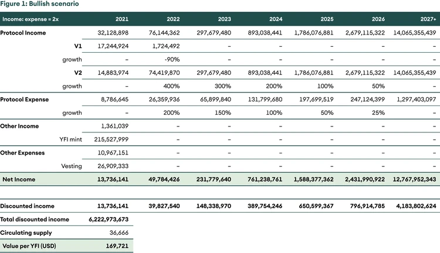
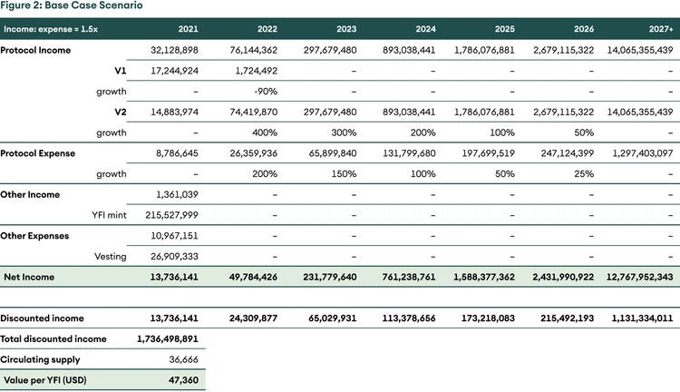

## Yearn Finance - Merkezi Olmayan Varlık Yönetimi

Özet

_Digital Investor'ın bu sayısında, en büyük merkezi olmayan varlık yönetimi protokolü olan Yearn Finance'i ele alıyoruz. Adil lansmanını, token'in değeri, hendeğini ve önemli protokol güncellemelerini ele alıyoruz. Son olarak, DCF._ kullanarak belirteç için makul bir değer bulmaya çalışırız.

## Giriş

Yearn Finance, istikrarlı ve riskli varlıklar üzerinde pasif kazanç elde etmek için Varlık Yönetimine öncülük eden merkezi olmayan bir finans (DeFi) protokolüdür. Bunu, mevduat sahiplerinin fonlarını en yüksek getiriler için en iyi getiri üreten stratejilere tahsis eden otomatik bir varlık yöneticisi olarak düşünebiliriz.

Andre Cronje tarafından iEarn adlı basit bir getiri üreten ürün olarak başlayan şey, akıllı sözleşmelerin temeli üzerine inşa edilmiş bir finansal yapıya dönüştü. iEarn, Compound, Aave ve dYdX arasında en yüksek faiz üreten protokol aracılığıyla varlıkları ödünç veren basit bir üründü. Bununla birlikte, Yearn Finance, farklı stablecoin tasarruf hesaplarına fon tahsis etmekten çok daha fazlasını yapıyor.

Yearn Finance, en alakalı olanı vault'lar olmak üzere geniş bir ürün yelpazesi sunar. vault'lar, mudiler için seçtikleri varlıklarda (sadece stablecoin yerine) en iyi verimi sağlayan çeşitli stratejilere fon tahsis eden ve kullanıcıların tercih ettikleri varlığa maruz kalmayı sürdürürken bir getiri elde etmelerini sağlayan dinamik strateji toplayıcılarıdır.

## Arka Plan

Yearn, yönetim belirteci YFI'yi 2020 yılının ortalarında başlattı ve alandaki en adil belirteç dağıtımlarından biri olarak lanse edildi. YFI jetonları, likiditelerini protokole yatıran belirli Curve ve Balancer havuzlarının likidite sağlayıcılarına verildi. Başlangıçta sadece 30.000 YFI basıldı ve tüm staker'lere tamamen dağıtıldı. Topluluk, likidite sağlayıcıları, geliştiriciler ve katkıda bulunanlar için devam eden teşvikler oluşturmak için daha fazla YFI'nin basılmasına izin veren Teklif 0'ı onayladı.

Sınırlı arz ve yüksek kullanım ile YFI fiyatı, kurucunun sıfır finansal değere sahip olduğunu iddia etmesine rağmen, piyasaya sürüldükten sonraki birkaç ay içinde 32 USD'den yaklaşık 43.000 USD'ye fırladı. Bununla birlikte, [yönetişim belirteci](https://www.seba.swiss/research/governance-tokens-coordinating-the-human-element/) YFI'nin platformun iyi çalışması için önemli bir değere sahip olması gerektiğine inanıyoruz, çünkü belirteç sahipleri mevduat sahipleri için sonuca karar veriyor. Yazma sırasında, Yearn Finance'in 3,8 milyar ABD doları değerinde kilitli değeri vardır ve bunun yaklaşık olarak [%78'i](https://yearn.science/) vault'lardadır.

## YFI neden sıfır olmayan bir değere sahip olmalıdır?

Tüm yönetim belirteçleri aynı değildir. YFI, sahiplerinin farklı vault'lar için stratejiler üzerinde oy kullanmasına, ücret yapısını değiştirmesine, yeni madeni paralar basmasına ve ödülleri katkıda bulunanlara dağıtmasına olanak tanır. Token sahipleri ayrıca yaklaşık 0,6 milyar USD'lik protokol hazinesini de kontrol ediyor. Sıfır olmayan bir fiyat, yönetim kararları alanların kötü bir karar alınması durumunda kaybedecek bir şeyleri olduğu anlamına gelir. Sonuç olarak, token sahipleri, stratejilerin çekiciliğini artıran ve AuM ve protokol gelirini artıran iyi kararlar almaya teşvik edilir.

## Yearn'in savunulabilirliği

Açık kaynak projeleri çatallanabilir. Bu durumda Yearn'in savunulabilirliği nedir? Yearn için öncelikli hendeklerden biri, ganimetleri strateji yazarlarıyla paylaşması. YIP-52'ye (Yearn İyileştirme Önerisi) göre Yearn, vault stratejistlerini stratejide eşit ortaklar haline getirdi. Yearn vault'ları, mevduat sahiplerinden yıllık %2 bakım ücreti ve %20 performans ücreti almaktadır. YIP-52'den önce stratejist performans ücretinden sadece %0,5, protokol hazinesine %19,5 kazandı. YIP-52 onaylandıktan sonra, kâr stratejist ve hazine arasında eşit olarak bölünür. Vault büyükse, iyi bir strateji yazarı için önemli kazanımlar sağlayabilir. Yearn, herhangi bir merkezi olmayan varlık yöneticisinin en yüksek AuM'sine sahiptir ve bu nedenle, en iyi strateji yazarlarının stratejilerini yalnızca onunla paylaşmaları için en yüksek teşviki sağlar. Bu, daha iyi getiriler, daha yüksek AuM ve daha iyi stratejistlerden oluşan erdemli bir döngü yaratır.

İkinci olarak, ironik olsa da güven, artan ağ etkilerinin önemli bir yönüdür. Ethereum projelerinin bazı Binance Akıllı Zincir çatallarında görüldüğü gibi, ekip projeyi çatalladıysa ve derinlemesine anlamadıysa, saldırı ve açıklardan yararlanma daha olasıdır. Yearn'in ekibi bu alanda bir öncüdür ve değişen bir ortama uyum sağlayabileceklerini göstermiştir. Verim düştüğünde, onu artırmak için vault'ların stratejilerini değiştirdiler. Yearn'in ekibi bu alanda bir öncüdür ve değişen bir ortama uyum sağlayabileceklerini göstermiştir. Verim düştüğünde, onu artırmak için vault'ların stratejilerini değiştirdiler. Yeni stratejiler geliştirilmediğinde, yönetim stratejistlerin ödüllerini artırma çağrısı yaptı. Uyarlanabilirlik, takımın uzun vadede teslim etme yeteneğine işaret ederken çatalların ömrü daha kısa olabilir.

### Ama verim Yearn'ın değişmez bir özelliği midir?

Açık bir soru, kripto varlıklar içindeki getirilerin sabit olup olmadığıdır. Neyse ki, geleneksel finans, gelişmiş dünyada yüzde 0'a yakın faiz oranlarıyla çıtayı çok yükseğe koymadı. Kripto varlık ekosistemindeki getirilerin döngüleri takip edeceğini düşünüyoruz. Daha yüksek verim, daha fazla kullanıcıyı cezbeder ve bu da ücretleri artırır. Daha yüksek ücretler küçük yatırımcıları caydırır ve bu nedenle getiri [düşer](https://www.seba.swiss/research/yearn-finance-decentralised-asset-management)[^1]. Daha küçük yatırımcılar blok zinciri ile etkileşime girmeyi bıraktıkça ücretler düşer. Daha düşük ücretlerle birlikte bir sonraki fiyat artışı döngüsü, daha küçük yatırımcıları katılmaya teşvik eder ve döngü tekrar eder. [Önceki Dijital Yatırımcımız](https://www.seba.swiss/research/defi-investment-strategies-a-performance-review) bu hipotezi açıklıyor.

DeFi jetonlarının fiyatları son kripto çöküşünde bir darbe alsa da, çeşitli DeFi protokollerinde kilitlenen jetonların sayısı neredeyse sabitti. Giderek daha fazla bitcoin ve sabit para, getiri arayışında Ethereum blok zincirinde olmak istiyor. DeFi'nin daha gidecek çok yolu olduğuna inanıyoruz.

## Yatırım tezi

### Aşağıdan yukarı

DeFi'nin yükselişi, sahiplerinin yalnızca fiyat artışlarından değil, aynı zamanda çeşitli varlıklar üzerinde pasif gelir elde etmelerinden de faydalanmalarını sağlar. Yearn ikincisini kolaylaştırır. Sahipler bağımsız olarak bu getiriyi Yearn olmadan kazanabilse de, protokol birkaç avantaj sunuyor. İlk olarak, ortalama sahibinin kendi fonlarını hareket ettirmesinden daha güvenlidir. DeFi vahşi bir batıdır, teknik konulardan anlayanlar bile hack'lerin ve açıkların kurbanı olmuştur. Ortalama bir kullanıcı, akıllı sözleşmeleri denetleyemez ve dinamik bir ortamda fon dağıtamaz. Yearn'in ekibi oldukça deneyimlidir ve tuzakları kullanıcılarından daha iyi anlar ve bu nedenle riske göre ayarlanmış daha iyi getiriler sağlayacak bir konumdadır. İkincisi, gaz ücretlerinin çok yüksek olabileceğini biliyoruz. Küçük yatırımcılar (<10.000 ABD Doları) fiyatlandırılmıştır ve verim çiftçiliği faaliyetine ayak uyduramazlar. Yearn, fonları bir havuzda toplama seçeneği sunar ve böylece gaz maliyetlerini sübvanse eder.

YFI, doğrudan platformun kazançlarından yararlanır. Protokol, %2 yönetim ücreti ve %20 performans ücreti almaktadır. Yönetim ücretlerinin tamamı ve performans ücretlerinin %50'si token sahipleri tarafından kontrol edilen hazineye tahakkuk eder. Giderler hariç, protokol kazançları açık piyasadan YFI'yi geri almak için kullanılır (aşağıdaki YIP-56'ya bakın). Sınırlı sayıda YFI, büyüyen TVL ve hazineden gelen sürekli satın alma baskısı ile tokenomiklerin fiyat için güçlü bir itici güç olması muhtemel.

### Yükarıdan aşağıya - ### Yukarıdan aşağıya – makro ortam, Yearn Finance gibi bir ürün için can atıyor

Gelişmiş dünyanın çoğu yaşlanıyor. Baby [boomers](https://www.seba.swiss/research/yearn-finance-decentralised-asset-management)[^2]önümüzdeki birkaç yıl içinde emekli olacak ve emekli maaşları hayatlarının önemli bir parçası olacak. Bebek patlamalarından önceki neslin aksine, mevcut emeklilik koşulları farklıdır. İlk olarak, ortalama yaşam süresi arttıkça, 60 yaşındaki emekliler büyük ölçüde emekli maaşlarına bağlı olarak 25 yıl daha yaşayacaklar. İkincisi, bir önceki nesil emekli olduğunda faiz oranları %18 civarındaydı ve tasarruf sahiplerinin lehineydi. Şu anda faiz oranları 0'a yakın ve bu da tasarrufu teşvik etmiyor. Emekliliğe ulaşan büyük bir nüfusun ve sıfıra yakın faiz oranlarının birleşimi zayıf bir kombinasyon. Gelişmiş dünyanın çoğu bu sorunla karşı karşıyadır (veya karşılaşacaktır).

Bitcoin, kripto varlık endüstrisinin bayrak taşıyıcısı olmuştur. Bununla birlikte, 2020, sabit paraların aynı zamanda dijital varlık devriminin heyecan verici yönlerinden biri olduğunu kanıtladı. Stabilcoin'lerle dolar üzerinden getiri elde etme fırsatı geliyor. Bu, yalnızca kripto para yerlileri için değil, aynı zamanda portföylerinin bir kısmından yıllık yaklaşık %6-8 civarında getiri elde etmenin zorunlu olduğu karmaşık fonlar için de heyecan verici bir fırsat. Emeklilik fonlarının şu anda varlıkları yaklaşık [32 trilyon ABD Doları](https://www.oecd.org/pensions/Pension-Funds-in-Figures-2020.pdf) (yalnızca ABD yaklaşık 18,8 trilyon ABD dolarına sahiptir). Toplam negatif getirili borcun [17 trilyon ABD dolarını](https://www.ft.com/content/378acc52-b1a5-4d58-8a87-8ea052b2c610) ve Microstrategy ve Tesla, Bitcoin'i yedek varlık olarak seçiyor.

Emeklilik fonları için henüz çok erken olsa da, daha maceracı fonlar ve bireyler, negatif getiri ortamlarından kaçmak için Ethereum üzerine kurulmuş platformları test etmeye cazip gelebilir. Geleneksel finans ve merkezi olmayan finans daha fazla bütünleştiğinden, Yearn Finance, merkezi olmayan varlık yönetimi alanında lider olarak sermayenin önemli bir kısmını talep etmek için iyi bir konumda olacaktır.

## ## Yönetim ve önemli protokol değişiklikleri

Yearn Finance, yönetişim açısından en aktif protokollerden biridir. Genel olarak, teklifler önce yönetişim forumunda tartışılır ve daha sonra YIP (Yıl İyileştirme Önerisi) şeklinde zincirleme oylamaya giderler. Yearn ayrıca düzenli olarak [üç aylık kazanç raporu](https://github.com/yearn/yearn-pm/blob/master/financials/reports/2021Q1-yearn-quarterly-report.pdf) sağlayan ilk DeFi protokolüdür. Bunun DeFi alanında norm haline gelmesi gerektiğini düşünüyoruz.

### YFI arzındaki değişiklik (0.Teklifve YIP-57)

İlk teklif, YFI arzını değiştirmekti. YFI en adil lansmanlardan biriyle başlamıştı ve topluluk daha sonra daha fazla jeton basmaya karar verdi. Yakın zamanda, [YIP-57](https://gov.yearn.finance/t/yip-57-funding-yearns-future/9319) uyarınca, protokol geliştirmeyi desteklemek için 6.666 yeni YFI jetonu basıldı. Yearn'in teşvikleri uyumlu hale getirmek için geliştiricilere hak kazanma paketlerini (2.222 YFI) genişletmesine izin verdi. Jetonların geri kalanı, protokol büyümesi için kullanılacak hazinede.

### Valut ücret yapısının değişimi (YIP-51)

Yearn V1 vault'ları, her para çekme işleminin ücretlendirildiği farklı bir ücret yapısına sahipti. [YIP-51](https://gov.yearn.finance/t/yip-51-set-vault-v2-fee-structure/7752) ücret yapısını 2/20 modeliyle değiştirdi. %2 bakım ücreti ve %20 performans ücreti.

### Oyun ortağında strateji uzmanı görünümü yapma (YIP-52)

%20'lik performans ücretinin %19,5'i hazineye, %0,5'i ise vault stratejistine ayrıldı. [YIP-52](https://gov.yearn.finance/t/yip-52-make-strategist-skin-in-game-partner-for-make-benefit-of-glorious-brain-of-yearn/7856)'nin yönetişim onayı, stratejisti performansta eşit bir ortak yaptı. Bu değişikliğin mantığı basitti, yearn'in savunulabilirliği, en iyi getiri fırsatlarını kullanan stratejistlere dayanıyor. Ve protokolün en iyi stratejistleri de aynısını yapmaya teşvik etmesi gerekiyor.

### Geri satın alma ve yapılandırma (YIP-56)

YFI başladığında, YFI sahiplerinin protokol gelirinden pay talep etmek için YFI'yi yönetim vault'una paylaştırmaları gerekiyordu. [YIP-56](https://gov.yearn.finance/t/yip-56-buyback-and-build/8929) yürürlükteyken, yönetim vault'u kullanımdan kaldırıldı ve protokol, YFI'yi geri satın alarak karları pazardan dağıtmaya başladı. Stake ve yönetimi basitleştirdi ve ödülleri token sahiplerine yaydı. YIP ayrıca, geri alımlar yoluyla sermaye kazancı, hisse ödülleri yoluyla temettü gelirinden daha az vergilendirilebildiğinden, kazançları vergi açısından daha verimli hale getirdi. Bu iyileştirmenin bir başka yan ürünü de, YFI'yi kullananların oy kullanabilmesi nedeniyle YFI'yi daha verimli hale getirmekti. Örneğin, kullanıcılar Maker'da DAI basmak için teminat olarak YFI koyabilir ve diğer DeFi protokollerini kullanarak DAI'den faiz kazanabilir.

## Ekspertiz

Yearn, kümülatif olarak, Ağustos 2020'den bu yana 8 milyon ABD dolarından fazla ödül üretti ve bunun 5 milyon ABD dolarına yakını Nisan 2021'e kadar kazanıldı ve bu ödül yalnızca Nisan ayının 2,7 milyon ABD dolarına ulaştı.

Yearn Finance'e değer vermek sıkıcı bir iştir. Yearn, bağlama şeklinde veya sadece bunları kullanarak, diğer birçok protokolle çalışır. Dikkate değer bazı sözler Curve, Sushiswap, Cream ve Badger'dır. Birleştirilebilirlik, büyümenin nasıl sonuçlanabileceğini tahmin etmeyi zorlaştırıyor.

Üç senaryo varsayıyoruz - yükseliş, temel durum ve muhafazakar. Senaryolar, harcanan birim dolar başına farklı büyüme ve gelir varsayımları kullanır. Yükseliş senaryosu için gelir/gider 2x iken, baz senaryo ve muhafazakar senaryo için sırasıyla 1.5x ve 1.2x aynı.

%25'lik bir iskonto oranı, %5'lik bir terminal büyüme oranı kullanarak ve üç senaryoya da eşit ağırlık vererek, YFI başına ~75.000 USD'lik bir gerçeğe uygun değere ulaşıyoruz.

### Şekil 1: Yükseliş Senaryosu

### Şekil 2: Temel Durum Senaryosu

### Şekil 3: Tutucu Senaryosu

## Riskler

Diğer tüm DeFi protokolleri gibi Yearn de akıllı sözleşme riskine karşı savunmasızdır. Yearn için kendine özgü risk, verimin tükenmesi ve uzun süre düşük kalmasıdır. Düşük getiri, yatırımcıların Yearn'de fonları kilitlemeleri için hiçbir teşvik olmadığı anlamına gelir. Düşük verim tipik olarak bir ayı piyasası olgusu olabilir. Yearn ekibinin uzun dönemli düşük verimlerle nasıl başa çıkacağını göreceğiz. Son zamanlarda fiyatlardaki düşüşe ve sessiz duygulara rağmen, Yearn stablecion ve curve ile ilgili ürünler üzerinde kazançlı getiriler sunmaya devam ediyor.

## Çözüm

Yearn finansmanı, stratejilerin kopyalanabileceği açık kaynaklı bir protokol olmasına rağmen, Yearn'in benzersiz bir teklifi olduğunu düşünüyoruz - iyi teşvik edilmiş stratejistler aracılığıyla yüksek riske göre ayarlanmış getiriler elde etmek için fonları pasif olarak döndürün. Yearn Finance'in deneyimli ekibinin ve güçlü topluluğunun hendeği olduğunu düşünüyoruz. Merkezi olmayan varlık yöneticileri arasında en yüksek TVL'ye sahiptir ve eşit kar paylaşımı ile akıllı alfa üreticilerini çekmek için en iyi konumdadır. Stratejistleri elinde tutma yeteneği, pasif yatırımcılara, platformun kendileri için tutarlı alfa bulmaya devam edeceğine dair güven vermelidir.

<!-- Altta kendilerini dipnotlıyorlar. -->

## Notlar

[^1]: Burada anlaşılması gereken en önemli şeylerden biri verimin kökenidir. Geleneksel olarak, insanlar borç para alır ve faizi ödemek için ödünç alınan miktardan daha fazla değer yaratır. DeFi'de getiri, riskli varlıklarının istikrarlı para ödünç almanın faiz maliyetinden daha iyi performans göstereceğine inanan yatırımcılar tarafından üretilir. Diğer verim kaynağı, protokollerin etkin kullanıcılara ve protokolün katkıda bulunanlarına yönetişim belirteçlerini dağıttığı protokol yayınlamadır.
[^2]: 1946-1964 yılları arasında doğanlar
