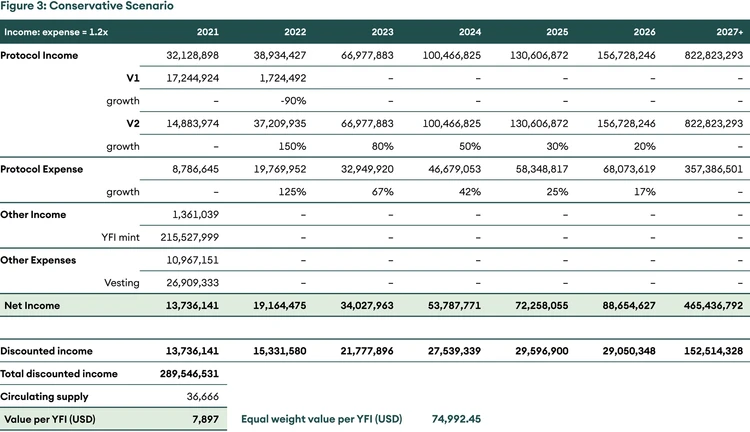

## Yearn Finance – 去中心化资产管理

摘要

_在本期 <数字资产投资者> 中，我们涵盖了最大的去中心化资产管理协议，Yearn Finance。我们谈到它的公平成立、其代币的价值驱动因素、它的竞争优势和重要的协议更新。最后，我们尝试使用DCF为其代币找到公允价值。_

## 引言

Yearn Finance是一个去中心化金融 （DeFi） 协议，它首创了资产管理为用户以稳定和高风险资产赚取被动收益。大家可以将其视为一个自动化资产管理机器人，它可将存款人的资金分配到可以产生最佳收益的策略中以获得最高的回报。

最初由Andre Cronje推出的简单收益生成产品（名为 iEarn）如今已演变成建立在智能合约基础上的金融大厦。iEarn 是一个简单的产品，可以通过像Compound、Aave和dYdX等高利息生成协议出借资产。然而Yearn Finance可做的不仅仅是将资金分配到不同的稳定币储蓄账户。

Yearn Finance提供广泛的产品，最主要的是机枪池。机枪池基本上是动态策略聚合器，将资金分配给各种策略，为存款人选择的资产（不仅仅是稳定币）提供最佳收益，让用户在保持对首选资产的敞口的同时也赚取收益。

### 背景

Yearn于2020年7月中旬推出了其治理代币，YFI，并被吹捧为DeFi领域中最公平的代币分配之一。YFI代币被作为激励奖励提供给一些Curve和Balancer池的流动性提供者，这些用户也必须将他们的流动性抵押在协议中。一开始，只有30,000枚YFI代币被铸造并完全分配给所有的抵押者。之后，社区批准了提案0，允许协议铸造更多的YFI，为流动性提供者、开发者和贡献者供应持续的激励。

由于供应有限且使用率高，尽管创始人声称其财务价值为零，但YFI的价格在推出后的几个月内从32美元飙升至43，000美元左右。然而，我们认为YFI[治理代币](https://www.seba.swiss/research/governance-tokens-coordinating-the-human-element/)，必须具有重要价值才能帮助平台正常运行，因为代币持有者可决定了存款人的回报率。 在撰写本文时，YFI已锁定了38亿美元的价值，其中约[78%被锁定](https://yearn.science/)在机枪池中。

### 为什么YFI应该有一个非零值?

并不是所有的治理代币都是一样的。YFI允许持有者为机枪池的策略进行投票，改变费用结构，铸造新币并分配激励奖励给贡献者。代币持有者还控制着值约6亿美元的协议金库。 有一个非零的价格意味着如果做出错误决定，那些做出治理决策的人会失去一些价值。因此，代币持有者会有一定的动力去做出正确的决策，以提升策略的吸引力并增加管理资产和协议收入。

## Yearn的防御能力

开源项目是可以被分叉的。在这种情况下，Yearn 的防御能力是什么？ Yearn 的主要竞争优势之一是它与策略家分享收益。根据YIP-52（Yearn改进提案），Yearn让机枪池策略家在策略中成为平等伙伴。Yearn机枪池向存款人收取2%的年度维护费和20%的绩效费。在YIP-52之前，策略家仅从绩效费中赚取0.5%，而19.5%被送入协议金库。YIP-52获得批准后，利润在策略家和协议金库之间平分。 如果机枪池的规模很大，一个好的策略可以为其创造者带来可观的收益。在所有去中心化资产管理公司中，Yearn管理的资产量是最高的，因此，它可为最好的策略家提供最高的奖励，以用来激励他们只与Yearn分享策略。 这创造了更好的回报、更大的资产管理规模和更优秀的策略家的良性循环。

其次，虽然有点讽刺，但信任是增加网络效应的一个重要点。 例如，根据我们在币安智能链上看到的一些以太坊分叉项目所发生的情况来看，如果团队分叉了该项目但没有深入了解它，则他们较有可能被黑客攻击和利用。Yearn的团队是该领域的先驱，并已显示了其适应不断变化的环境的能力。 当收益率下降时，他们改变了机枪池的策略以增加它收益。 当缺乏新策略时，治理通过以增加策略家的奖励来应对。 适应性指向团队长期交付的能力，而分叉的寿命可能较短。

### 但收益是Yearn可持续的特征吗?

一个明显的问题是加密资产中的收益率是否可一直持续。值得庆幸的是，传统金融并没有设定太高的标准，即使在发达国家，利率也接近于0%。我们认为加密资产生态系统内的收益率将遵循周期。 较高的收益会吸引较多的用户，从而增加费用。 较高的费用会使小规模投资者望而却步，因此收益率会下降。 随着小规模投资者停止与区块链互动，费用会下降。 接着下一个周期价格上涨与较低成本费用相结合再次鼓励小规模投资者参与，循环像这样不断地重复。我们上一期的[数字资产投资者](https://www.seba.swiss/research/defi-investment-strategies-a-performance-review) 已解释了这一假设。 

DeFi代币的价格在最近的加密货币崩盘中受到打击，但锁定在各种DeFi协议中的代币数量几乎保持不变。越来越多的比特币和稳定币想要在以太坊区块链上寻找被动收益。因此我们认为DeFi还有很长的路要走.

## 投资论文

### 自下而上

DeFi的兴起使持有者不仅可以从价格上涨中受益，还可以从各种资产上获得被动收入。 Yearn为后者提供了服务。虽然持有者也可以在没有Yearn的情况下自己赚取被动收益，但该协议提供了一些好处。首先，它比普通持有人移动自己的资金较安全。DeFi是一个狂野的西部，即使是那些了解技术方面的人也可成为黑客和漏洞利用的受害者。普通用户是不可能在像这样的动态环境中适当地审计智能合约和部署资金。Yearn的团队经验丰富，比大多数用户更了解可能的陷阱，因此能够提供较好的风险调整回报。其次，我们知道gas费用是非常的高。小规模投资者（< 10,000 美元）付不起费用，无法跟上几个收益农场的步伐。Yearn提供了汇集资金的好处，从而可补贴用户的gas费用成本。

YFI可直接从平台的收益中受益。该协议收取2%的管理费和20%的绩效费。全部的管理费和 50%的绩效费都将归属于由代币持有者控制的金库。扣除掉费用后，该协议收益将被用于从公开市场回购YFI（请查看下面的 YIP-56）。由于YFI供应数量有限，TVL正在不断地增长以及来自协议财库的持续购买压力，此代币模型很可能会成为未来YFI市价的强大驱动力。

### 自上而下 - 宏观环境渴望像YFI这样的产品

世界上大部分发达的地区都正在老龄化。婴儿潮一代将在未来几年就会退休了，养老金将成为他们生活中必不可少的一部分。与上一代相比，婴儿潮一代的不同之处在于目前的退休条件已经改变了。首先，随着预期寿命的增长，在60岁退休的人可能还会再多活25年，他们将严重依赖养老金来过活。 其次，当上一代退休时，利率在18%左右，是有利于储蓄者的。而目前的利率是接近于0的，这并不能激励储蓄。大量退休人口和接近零的利率相结合在一起是一个很糟糕的组合。大多数的发达国家都面临（或将面临）这个问题。

比特币一直是加密资产行业的旗手。 然而，2020年已证明，稳定币也是数字资产革命中令人兴奋的方面之一。稳定币带来了赚取美元收益的机会。这不仅对加密货币长期持有者来说是一个令人兴奋的机会，而对处于尖端的基金来说也是非常令人兴奋的，因为这些基金的任务是从他们投资组合的某些部分赚取约6-8%的年回报率。目前养老基金持有价值约[32万亿美元](https://www.oecd.org/pensions/Pension-Funds-in-Figures-2020.pdf)的资产（仅美国就持有约18.8万亿美元）。我们生活在一个负收益债务总额已超过[17万亿美元](https://www.ft.com/content/378acc52-b1a5-4d58-8a87-8ea052b2c610)的世界，而Microstrategy和特斯拉等上市公司已选择比特币作为储备资产。

虽然现在对养老基金来说可能还为时尚早，但很多有冒险精神的基金和个人，为了摆脱负收益环境，可能会想测试一些建立在以太坊上的平台。 随着传统金融和去中心化金融的融合，Yearn Finance，因已占有相当大的资本份额，将处于有利地位作为去中心化资产管理领域的领导者。

## 治理和重要的协议变更

就治理而言，YFI是最活跃的协议之一。一般来说，提案首先会在治理论坛上被提出和讨论，然后以YIP（Yearn Improvement Proposal 或Yearn改进提案）的形式在链上投票。Yearn也是第一个定期提供[季度收益报告](https://github.com/yearn/yearn-pm/blob/master/financials/reports/2021Q1-yearn-quarterly-report.pdf)的DeFi协议。我们认为这应该成为DeFi领域的规范。

### YFI供应的变更 （提案0和YIP-57）

第一个提议是改变YFI的供应量。YFI从最公平的代币分配之一开始，之后社区决定铸造更多的代币。 最近，根据[YIP-57](https://gov.yearn.finance/t/yip-57-funding-yearns-future/9319)，已铸造了6,666枚YFI代币以支持协议开发的需求。它允许Yearn为开发人员提供归属计划（2,222 YFI）以调整激励措施。 其余的代币被存入财库将用于协议增长。

### 机枪池费用结构变更 (YIP-51)

Yearn V1机枪池有不同的费用结构，每次提款都要收费。 而[YIP-51](https://gov.yearn.finance/t/yip-51-set-vault-v2-fee-structure/7752)将费用结构更改为2/20的模型，其中协议收取2%的维护费和20%的绩效费。

### 让策略家成为skin in the game（利益共享，风险共担）合作伙伴 (YIP-52)

在20%的绩效费中，19.5%归协议财库，而0.5%分配给机枪池策略家。[YIP-52](https://gov.yearn.finance/t/yip-52-make-strategist-skin-in-game-partner-for-make-benefit-of-glorious-brain-of-yearn/7856)的治理提案让策略家在绩效方面成为平等的合作伙伴。这个变更的理由很简单，Yearn的防御能力依赖于策略家利用最佳收益机会，因此它需要激励最优秀的策略家做同样的事情。

### 为了建立Yearn而回购 (YIP-56)

当YFI刚开始时，YFI持有者必须将YFI质押到治理机枪池中才能获得协议收入的份额。随着[YIP-56](https://gov.yearn.finance/t/yip-56-buyback-and-build/8929)生效后，治理机枪池被淘汰掉，协议开始通过从市场回购YFI来分配利润。它简化了质押和治理，并将奖励分配到代币持有者之间。YIP还提高了收益的税收效率，因为通过回购实现的资本收益的税收会低于通过抵押代币获得的份额收入。这个变更的另一个副作用是使YFI更有效率，因为持有者可以在使用YFI的同时投票。举个例子，用户可以将YFI作为抵押品在Maker上铸造DAI，并使用其他DeFi协议应用DAI来赚取利息。

## 估值

自2020年8月以来，Yearn累计产生了超过800万美元的奖励，其中近500万美元是在2021年4月前赚取的，换句话说，仅四月一个月内就赚取了270万美元。

评价Yearn Finance是一项繁琐的任务。 Yearn与其他几种协议一起工作，无论是以合作的形式还是仅应用它们。值得一提的合作伙伴是Curve、SushiSwap、Cream和Badger。协议的可组合性使得很难预测未来的增长会如何发展.

我们假设三种情况 - 看涨、基准和保守。情景使用不同的增长率和每单位花费的收入假设。对于看涨情景，收入/支出为2倍，而基准情景和保守情景的收入/支出分别为1.5倍和1.2倍。

使用25%的贴现率，5%的终端增长率，并赋予所有三种情景同等的权重，我们得出的结论是每个 YFI的公允价值约为75,000美元。

### Figure 1: 看涨情景

### Figure 2: 基准情景

### Figure 3: 保守情景

## 风险

正如所有其他DeFi协议一样，Yearn也有智能合约的风险。Yearn的特殊风险是收益率逐渐消失并长时间地保持低位状态低收益意味着没有办法激励投资者将资金锁定在Yearn。 低收益率通常是熊市的现象。Yearn的团队将如何解决长期低收益率的问题还有待观察。尽管最近价格下跌而且市场情绪也低迷，Yearn仍然持续地为稳定币和Curve相关产品提供丰厚的收益。

## 结论

尽管Yearn Finance是一个开源协议，他们的策略可以被复制，但我们认为Yearn有一个独特的主张 - 通过激励报酬丰厚的策略家被动地轮换资金以赚取高风险调整后的回报。我们认为Yearn Finance经验丰富的团队和强大的社区是它的竞争优势。它在去中心化资产管理项目中拥有最高的TVL，并且有平等的利润分享，是最有可能吸引聪明和持有alpha的人。它可吸引和留住策略家的能力应该能使被动投资者相信该平台将继续为他们找到最有利的alpha。

<!-- Footnotes themselves at the bottom. -->

## 尾注

[^1]: 这里大家需要理解的重点是收益的来源。传统上，人们借钱并创造比借入的金额更多的价值来支付利息。在DeFi中，收益是由于投资者相信他们的高风险资产会胜过借入稳定币的利息成本而产生的。收益的另一个来源是来自于协议发行，协议将治理代币分发给他们的活跃用户和贡献者。
[^2]: 那些在1946和1964出生的
