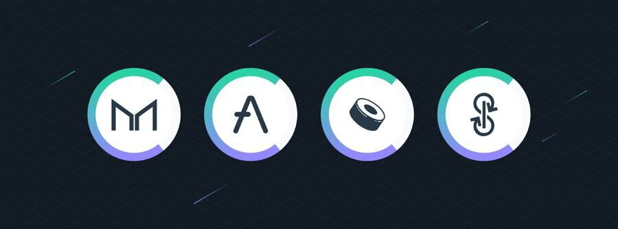

# Newsletter #43 de Yearn Finance

Bienvenido a la 43.ª edición de la newsletter de Yearn Finance. Nuestro objetivo con esta newsletter es mantener a la comunidad de Yearn y a la comunidad cripto informada sobre las últimas noticias, incluidos los lanzamientos de productos, los cambios en la gobernanza y las actualizaciones del ecosistema. Si estás interesado en obtener más información sobre Yearn Finance, sigue nuestras cuentas oficiales de [Twitter](https://twitter.com/iearnfinance) y [Medium](https://medium.com/iearn).

## **Resumen**

- YIP-63: Financiar DAO de activismo legal centrado en contructores
- Alchemix migra a Yearn v2
- YFI añadido a Compound Finance
- Intercambiar entre vaults de Yearn en una transacción
- Vaults en Yearn
- Noticias del ecosistema

## **YIP-63: Fund Builder-First Legal Activism DAO**

medio de un escrutinio regulatorio cada vez más intenso de DeFi, se ha propuesto que LeXpunK_DAO debería dedicarse a la defensa legal de Yearn y otras comunidades DeFi centradas en constructores. El LeXpunK_DAO estará gobernado por constructores de comunidades contribuyentes (incluido Yearn) y abogados en ejercicio del LeXpunK Army 146.

El 5 % del suministro actual de L3X, el token de gobierno no transferible de LeXpunK Army, se enviará via airdrop a los titulares de YFI que apoyen esta propuesta, para permitir encuestas de opinión directas sobre cuestiones legales relevantes de la comunidad de Yearn. LeXpunK realizará airdrops adicionales de vez en cuando, proporcionalmente en línea con las contribuciones relativas de otras comunidades de constructores, con el objetivo de formar una coalición amplia para reunir recursos para financiar objetivos de defensa compartidos.

Los comentarios de representantes de EE. UU. como Gary Gensler, presidente de la SEC, han sido increíblemente preocupantes para el futuro de DeFi, y LeXpunK_DAO tiene como objetivo aliviar las preocupaciones que los reguladores puedan tener a través de campañas, redadas y otros métodos claramente establecidos en la propuesta.

Lee la propuesta completa en el foro de Yearn [aquí](https://gov.yearn.finance/t/yip-63-fund-builder-first-legal-activism-dao/11280).

YIP aprobada. Puedes ver los resultados [aquí](https://gov.yearn.finance/t/proposal-fund-builder-first-legal-activism-dao/11280).

## **Alchemix migra a Yearn v2**

Alchemix ha migrado con éxito a la última versión de yvDAI. El pequeño pico en el gráfico es de $400 millones que se mueven de las vaults v1 a las vaults v2. Estamos orgullosos de ser el backend de mayor rendimiento para DeFi.

Yearn ha experimentado un crecimiento exponencial en los últimos meses, y parte de esto se puede atribuir a nuestros socios, como Alchemix, que utilizan Yearn como infraestructura de vault. Esperamos que este crecimiento continúe, ya que nuestras vaults brindan algunos de los mejores rendimientos ajustados al riesgo en DeFi, a la vez que son las más simples. Deja que Yearn haga el trabajo duro por ti y aumente continuamente tus fondos.

Echa un vistazo a las vaults [aquí](https://yearn.finance/vaults).

## **YFI agregado a Compound Finance**

YFI se ha agregado con éxito a Compound Finance como mercado. Actualmente, tiene un factor de garantía cero (inicialmente), el mismo modelo de tasa de interés (como COMP/LINK) y un factor de reserva del 25% para cada mercado (que es estándar). En un futuro cercano, se incrementarán los factores de garantía y los usuarios podrán suministrar YFI en Compound y tomar prestadas monedas con garantía de YFI. Esto permitirá a los estrategas de Yearn posiblemente crear una estrategia de agricultura de YFI similar a una estrategia actual implementada para la vault de YFI que utiliza MakerDAO. Por lo tanto, los usuarios pueden recibir más rendimiento neto gracias a esta integración, lo que generalmente mejorará los rendimientos. Lee más sobre la estrategia MakerDAO [aquí](https://yearn.fi/invest/0xE14d13d8B3b85aF791b2AADD661cDBd5E6097Db1).

Prestar y pedir prestado YFI [aquí](https://app.compound.finance/).

## **Intercambiar entre vaults de Yearn en una transacción**

Gracias al increíble trabajo de pandabuild, TBouder e Ivan, Bowswap aprovecha los metapools de Curve y la protección contra deslizamiento incorporada para permitirte intercambiar tus tokens de vaults por otros con mayor rendimiento sin tener que retirar.

Utiliza esta nueva función de intercambio [aquí](https://bowswap.finance/).

## **Vaults de Yearn**

Puede leer una descripción detallada de las estrategias para todos nuestros yVaults activas [aquí](https://medium.com/yearn-state-of-the-vaults/the-vaults-at-yearn-9237905ffed3).

## **Noticias del ecosistema**

[Element Finance lanza rendimiento fijo en USDC, confiando en Yearn para su backend](https://twitter.com/element_fi/status/1422934199284215810?s=20)

[Echa un vistazo a Banteg en la portada de la revista Fortune](https://twitter.com/FortuneMagazine/status/1420803860336152577)

[Ver la tabla de rarezas de los NFT de The Blue Pill](https://github.com/banteg/blue-pill#rarity-table)

[Flipside Crypto lanza recompensas por Yearn](https://twitter.com/BmurrayFlipside/status/1421147576674422788)

[Cozy Finance ajusta el mercado de cobertura USDC de Yearn](https://twitter.com/cozyfinance/status/1422226784674664453)

[El mercado Yearn crvTBTC se ha puesto en marcha en Cosy](https://twitter.com/cozyfinance/status/1422633897490223107)

[Anna Rose y Tarun Chitra del Podcast Zero Knowledge conversan con Facu Ameal y tracheopteryx sobre Yearn](https://www.zeroknowledge.fm/192)

[Echa un vistazo al nuevo twitter de Keep3r](https://twitter.com/thekeep3r)
