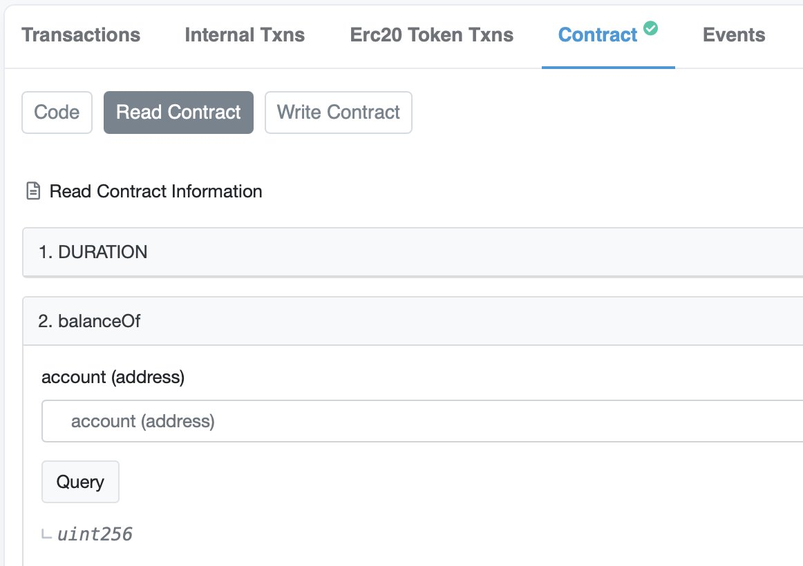
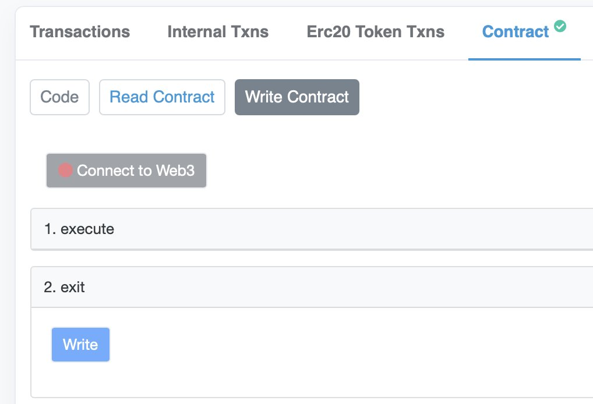

Originalquelle: [twitter](https://twitter.com/dudesahn/status/1413567068583104512)

##### 1

Habe mir gerade die alten [@iearnfinance](https://twitter.com/iearnfinance) Stakingverträge angesehen:

~30 nicht beanspruchte YFI in den ursprünglichen Stakingpools 
~8.5 YFI im v1-Stakingvertrag
~764 YFI noch im v2-Stakingvertrag mit $750k in beanspruchbarem yCRV 😬

Fast 29 Mio. $ an eingesetzten LPs, YFI und einforderbaren Belohnungen 👇

##### 2

Bist du dir nicht sicher, ob du einen Anspruch auf Mittel hast?

Rufe https://etherscan.io auf, und gib eine der folgenden Adressen ein:

• YFI Farming Pool 1: 0x0001FB050Fe7312791bF6475b96569D83F695C9f
• YFI Farming Pool 2: 0x033E52f513F9B98e129381c6708F9faA2DEE5db5

##### 3

• YFI Farming Pool 3: 0x3A22dF48d84957F907e67F4313E3D43179040d6E
• YFI Gov Staking v1: 0xb01419E74D8a2abb1bbAD82925b19c36C191A701
• YFI Gov Staking v2: 0xBa37B002AbaFDd8E89a1995dA52740bbC013D992

Klicke unter "Contract" auf "Read Contract", und gib unter "balanceOf" deine Adresse ein 👀.

##### 4

Wenn ein Wert >0 angezeigt wird, dann herzlichen Glückwunsch, kannst YFI und/oder Belohnungen erhalten! :partying_face:

Um alle deine Einsätze und Belohnungen einzufordern, gehe zu "Write Contract", verbinde dein Wallet und rufen exit() auf.

##### 5

Mit deinem frischen YFI oder yCRV in der Hand kannst du zu http://yearn.finance/vaults gehen und es in einem unserer Vaults deponieren. Alternativ kannst du auch zu unseren guten Freunden von @CreamdotFinance 🍦 gehen und diese Vermögenswerte beleihen oder sogar @MIM_Spell 🧙‍♂️  verwenden, um deine neuen yvYFI zu beleihen.

##### 6

Ebenfalls erwähnenswert: Nur weil du keine Einsätze mehr hast, heißt das nicht, dass du keine Belohnungen beanspruchen kannst! Ähnlich wie bei balanceOf() kannst du unter "Read Contract with earned()" prüfen, ob du Belohnungen einfordern kannst, und diese dann unter "Write Contract with getReward()" einfordern! 🤑

  

