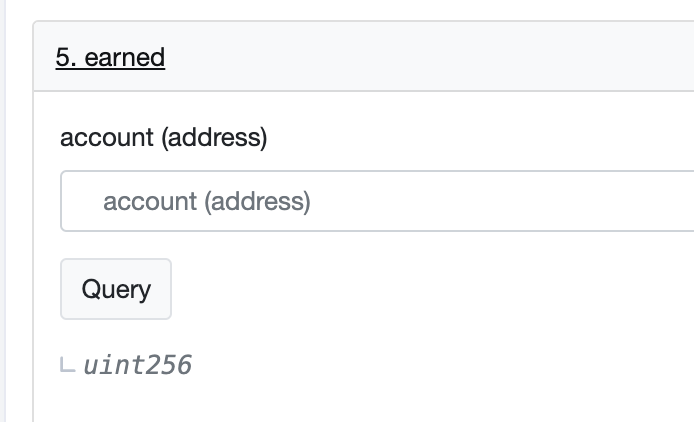
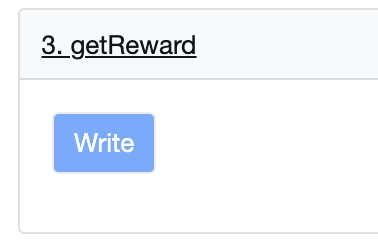

Αρχική Πηγή: [twitter](https://twitter.com/dudesahn/status/1413567068583104512)

##### 1

Μόλις έλεγξα τα παλιά συμβόλαια του [@iearnfinance](https://twitter.com/iearnfinance):

~30 YFI αζήτητα από τις αρχικές δεξαμενές του staking
~8.5 YFI staked σε ένα v1 συμβόλαιο
~764 YFI παραμένουν ακόμα staked σε ένα v2 συμβόλαιο με $750k σε διεκδικήσιμα yCRV 😬

Σχεδόν $29m σε staked LPs, YFI, και διεκδικήσιμες αμοιβές 👇

##### 2

Δεν είστε σίγουροι αν έχετε κεφάλαια προς διεκδικήση;

Πηγαίνετε στο https://etherscan.io, και εισάγετε μία από τις ακόλουθες διευθύνσεις:

• YFI Farming Pool 1: 0x0001FB050Fe7312791bF6475b96569D83F695C9f
• YFI Farming Pool 2: 0x033E52f513F9B98e129381c6708F9faA2DEE5db5

##### 3

• YFI Farming Pool 3: 0x3A22dF48d84957F907e67F4313E3D43179040d6E
• YFI Gov Staking v1: 0xb01419E74D8a2abb1bbAD82925b19c36C191A701
• YFI Gov Staking v2: 0xBa37B002AbaFDd8E89a1995dA52740bbC013D992

Κάτω από το Συμβόλαιο, κάντε κλικ στην επιλογή Διαβάστε το Συμβόλαιο και βάλτε τη διεύθυνσή σας κάτω από το balanceOf 👀

##### 4

Αν εμφανιστεί μια τιμή >0, τότε συγχαρητήρια, έχετε YFI ή/και ανταμοιβές για να διεκδικήσετε! 🥳

Για να διεκδικήσετε τα περιουσιακά σας στοιχεία και τις ανταμοιβές από το staking, μεταβείτε στο Write Contract, συνδέστε το πορτοφόλι σας και καλέστε την εντολή exit().

##### 5

Με το φρέσκο σας YFI ή yCRV στο χέρι, μπορείτε να πάτε στο http://yearn.finance/vaults και να το καταθέσετε τα σε ένα από τα θησαυροφυλάκια μας. Εναλλακτικά, κατευθυνθείτε προς τους καλούς μας φίλους στο @CreamdotFinance 🍦 και δανειστείτε έναντι αυτών των περιουσιακών στοιχείων, ή ακόμη και χρησιμοποιήστε το @MIM_Spell 🧙‍♂️ για να δανειστείτε έναντι του νέου σας yvYFI.

##### 6

Αξίζει επίσης να προσθέσουμε εδώ: το γεγονός ότι δεν έχετε αυτή τη στιγμή κεφάλαια staked, δεν σημαίνει ότι δεν μπορείτε να διεκδικήσετε ανταμοιβές! Παρόμοιως με την εντολή balanceOf(), μπορείτε να ελέγξετε για τυχόν διεκδικήσιμες ανταμοιβές στο Read Contract με την εντολή earned(), και στη συνέχεια να διεκδικήσετε τυχόν διαθέσιμες ανταμοιβές στο Write Contract χρησιμοποιώντας την εντολή getReward()! 🤑

  

