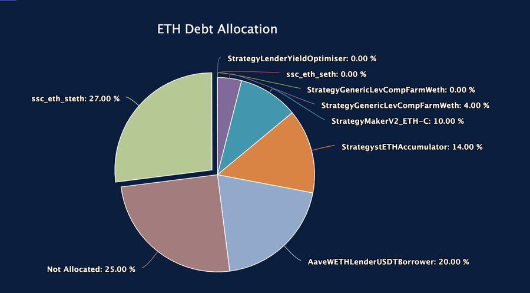
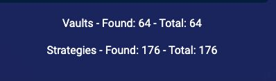
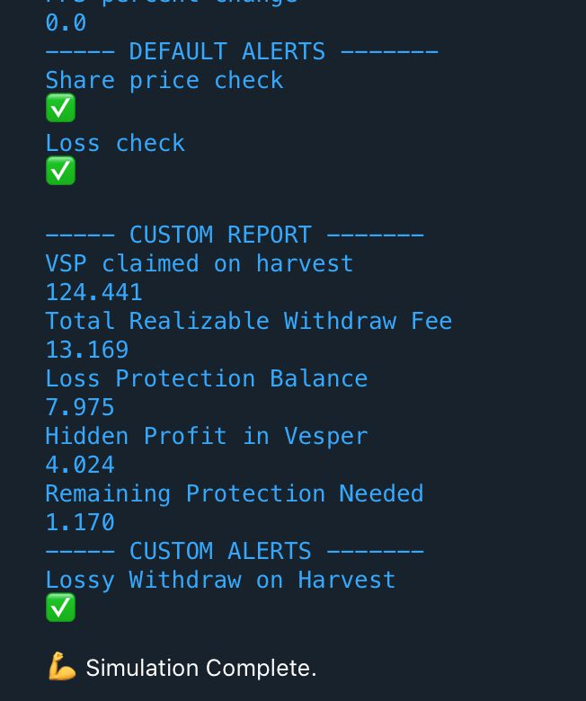
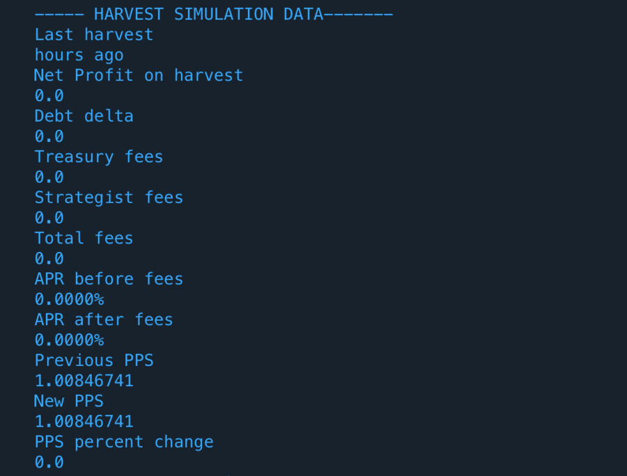
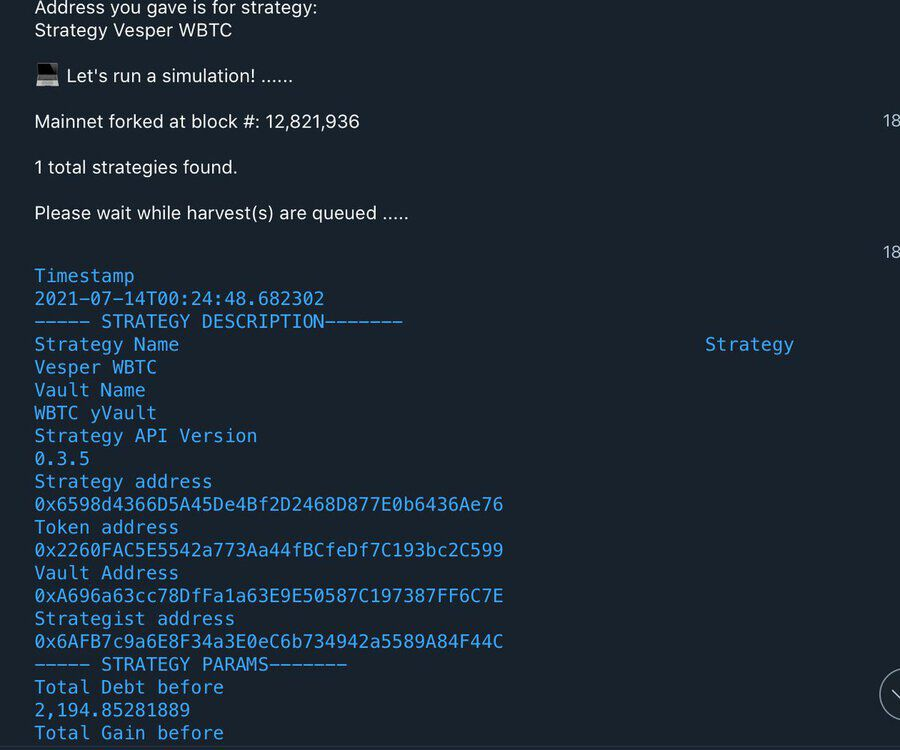
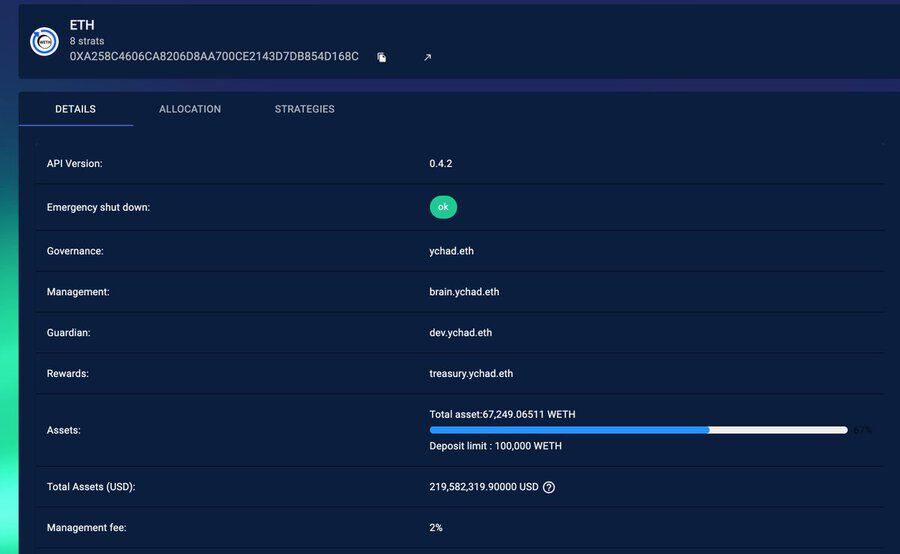
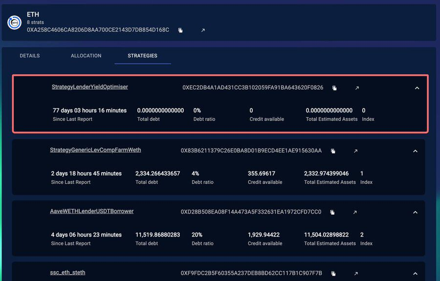
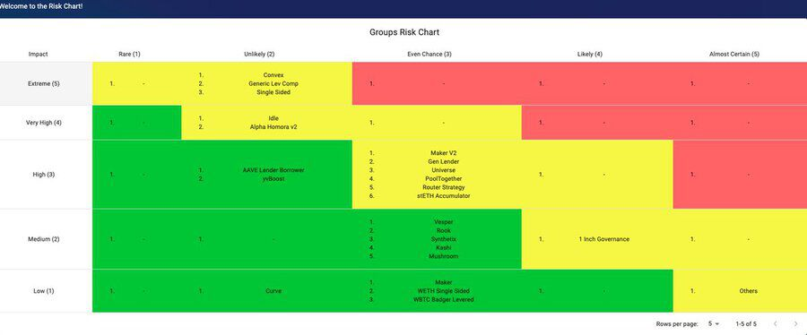
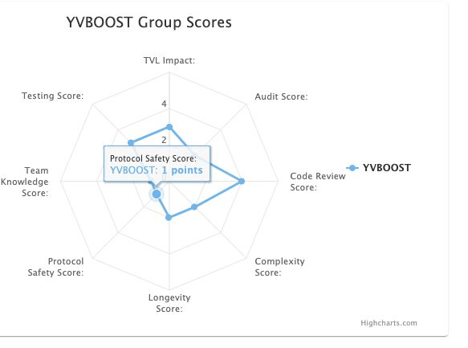
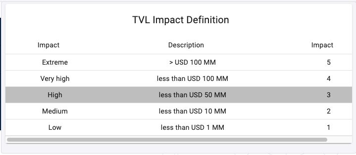

Αρχική Πηγή: [twitter](https://twitter.com/storming0x/status/1436851219864059906)

##### 1
Γράφω λίγο κώδικα αυτό το Σαββατοκύριακο και αποφάσισα να γράψω μερικά tweet σχετικά με τους κινδύνους του [@iearnfinance](https://twitter.com/iearnfinance) , τα εργαλεία και τη διορατικότητα πίσω από την σκηνή.

🧵 👇

##### 2
Αν δεν γνωρίζετε το [yearn.finance](http://yearn.finance), μπορείτε να το φανταστείτε ως το "πρωτόκολλο συνάρτησης απόδοσης". Το κορυφαίο προϊόν του Yearn είναι τα Θησαυροφυλάκια (Vaults). Βάλτε χρήματα στα θησαυροφυλάκια και με κάποιο τρόπο την επόμενη μέρα τα χρήματα αυτά αυξάνονται και συνεχίζουν να αυξάνονται συνεχώς. Αυτό είναι μια υπεραπλούστευμένη εξήγηση φυσικά.

##### 3
Αυτό καθίσταται δυνατό από μια ομάδα έξυπνων ανθρώπων που κωδικοποιούν στρατηγικές για το θησαυροφυλάκιο ώστε αυτό να μπορεί να κατανέμει τα διαθέσιμα σε αυτό χρήματα με στόχο την επίτευξη αποδόσεων. Οι στρατηγικές είναι έξυπνα συμβόλαια που πρέπει να αναπτύσσονται και να ενημερώνονται συχνά. Αυτά τα έξυπνα συμβόλαια είναι ευέλικτα και δυναμικά. Παράδειγμα κατανομών:

##### 4
Δεδομένου του τρόπου με τον οποίο λειτουργεί το πρωτόκολλο Υearn, χρειάζεται πολύ γρήγορα αντανακλαστικά για την ταχεία δρομολόγηση νέων συμβολαίων και στρατηγικών, και αυτό είναι κάτι που έχει επιπτώσεις στην ασφάλεια. Μια από τις κύριες ανησυχίες του yearn είναι ο κίνδυνος από όλες τις απόψεις. Είμαστε στο τέλος της ημέρας, στον τομέα των κινδύνων. Πώς μπορούμε να το εξισορροπήσουμε αυτό;

##### 5
Πρέπει να καταρτίσουμε ένα πλαίσιο κινδύνου. Για να καταλάβετε την εικόνα. Αυτός είναι ο αριθμός των θησαυροφυλακίων + στρατηγικών που αναπτύσσονται σήμερα. Δεν υπάρχει τρόπος να παρακάμψουμε την πολυπλοκότητα αυτού του συστήματος, πολλά κομμάτια πρέπει να λειτουργήσουν για να λειτουργήσει αυτό.

##### 6
Στην προηγούμενη ζωή μου ασχολήθηκα με συστήματα αεροναυπηγικής. Νομίζω ότι πολλά μαθήματα μπορούν να ληφθούν από την αεροπλοΐας, η οποία επίσης δραστηριοποιείται στον τομέα των κινδύνων. Η πολυπλοκότητα, όπως και στα χρηματοοικονομικά, είναι υψηλή. Παρόλα αυτά δεν το σκέφτεστε δύο φορές να κλείσετε μια πτήση για το επόμενο ταξίδι σας.

##### 7
Κάθε μέρα πραγματοποιούνται εκατομμύρια πτήσεις και πολλές πτήσεις έχουν περιστατικά. Ένα περιστατικό δεν οδηγεί αυτομάτος σε ατύχημα = συντριβή αεροπλάνου. Χρειάζεται να συμβούν πολλά περιστατικά ταυτόχρονα για να συντριβεί ένα αεροπλάνο. Αυτό με βάση τις σημερινές συνθήκες λειτουργίας των αεροπορικών εταιρειών είναι εξαιρετικά απίθανο.

##### 8
Όμως, κάθε φορά που συμβαίνει ένα οποιοδήποτε περιστατικό, η διαδικασία και τα συστήματα αεροπλοΐας απαιτούν να διορθώνετε τόσο το σφάλμα όσο και η βασική αιτία που το προκάλεσε. Έχουμε εφαρμόσει μια παρόμοια διαδικασία στο yearn, κάθε αίθουσα πολέμου που διαχειρίζετε κάποιο περιστατικό δεν οδηγεί σε απώλεια κεφαλαίων, αλλά απαιτείται να μαθαίνουμε από το κάθε περιστατικό και να βελτιωνόμαστε.

##### 9
Η διαδικασία αυτή εφαρμόστηκε στις αρχές του τρέχοντος έτους, μετά από έναν πραγματικά άσχημο μήνα γεμάτο με περιστατικά και αίθουσες πολέμου. Και αρκετές πρωτοβουλίες ξεκίνησαν και υλοποιήθηκαν για την αυτοματοποίηση και την όσο το δυνατόν μεγαλύτερη απομάκρυνση του ανθρώπινου παράγοντα από τις καθημερινές μας αποφάσεις.

[twitter.com/storming0x/sta…](https://twitter.com/storming0x/status/1395452522840608768?s=20)

> 
> Storm Blessed 0x ([@storming0x](https://twitter.com/storming0x))

> Μόλις βγήκαμε από μια αίθουσα πολέμου διάρκειας 16+ ωρών και πλέον που ασχολήθηκε με μια κατάσταση που αντιμετωπίσαμε στο yearn. Εξαιρετικά κουρασμένοι αλλά ευγνώμονες που είχαμε την ευκαιρία να είμαστε μέρος αυτής της φοβερής ομάδας.

Η κρίση επιλύθηκε και δεν χάθηκαν κεφάλαια. Πολλά βασικά συμπεράσματα και πράγματα που θα κάνουν το [@iearnfinance](https://twitter.com/iearnfinance) ισχυρότερο. Χρειάζομαι 😴

##### 10
Αυτή η διαδικασία βέβαια μπορεί να βελτιωθεί και είναι μια συνεχής διεργασία, αλλά στο Yearn αυτό που δεν μας σκοτώνει σίγουρα μας κάνει πιο δυνατούς. Είναι μέρος της δουλειάς μου να κάνω αυτή τη διαδικασία να εμπεδωθεί στο DNA του Yearn.

[github.com/yearn/yearn-de…](https://github.com/yearn/yearn-devdocs/blob/master/docs/developers/v2/EMERGENCY.md)

##### 11
Είχαμε αίθουσες πολέμου για περιπτώσεις στις οποίες ο κώδικας είχε ένα σφάλμα και έκανε λανθασμένη λογιστική που οδήγησε σε αίθουσες πολέμου και ζητήματα.
Επιδιορθώσεις:
-Προσθέσαμε ρομπότ προσομοίωσης για να βρίσκουμε τα προβλήματα πριν συμβούν στην αλυσίδα.
-Ελέγχους υγείας στην αλυσίδα που επαναφέρουν ένα trx εάν δεν πληρούνται οι απαραίτητες βεβαιώσεις.

[github.com/yearn/yearn-de…](https://github.com/yearn/yearn-devdocs/blob/master/docs/developers/v2/DEPLOYMENT.md#health-checks)

##### 12
Το ρομπότ προσομοίωσης είναι συνδεδεμένο με τις ειδοποίησεις στο Telegram μας και μας ειδοποιεί δίνοντάς μας αρκετό χρόνο για να διαχειριστούμε οποιοδήποτε ζήτημα. Πρόσφατα είχαμε μια αίθουσα πολέμου που τελικά ήταν αχρείαστη λόγω της προσομοίωσης, η στρατηγική τερματίστηκε χωρίς να χρειαστεί να διορθώσουμε τίποτα onchain. Μετακινηθήκαμε από τη διορθωτική στην προληπτική δράση.

##### 13
[yearn.watch](http://yearn.watch) είναι ο ιστότοπος που έφτιαξα για να παρακολουθώ τις στρατηγικές και την κατάσταση των θησαυροφυλακίων. Ο ιστότοπος χρησιμοποιεί ένα σπουδαίο κομμάτι της υποδομής που έχει κατασκευαστεί εσωτερικά από την ομάδα του yearn για την άντληση δεδομένων. Έχουμε εξειδικευμένα συμβόλαια πολλαπλών κλήσεων για να μπορούμε να λαμβάνουμε αυτά τα δεδομένα που είναι απαραίτητα για τη λήψη αποφάσεων.

##### 14
Έχουμε επίσης έναν πίνακα κινδύνου που δημιουργήσαμε για να βαθμολογούμε κάθε στρατηγική, ώστε να αξιολογούμε ανά πάσα στιγμή τον κίνδυνο που διατρέχουμε. Αυτό συμπληρώνεται από την εσωτερική μας υποδομή και προσαρμόζεται αυτόματα από τις αλλαγές στην αλυσίδα.
(Δείγμα δεδομένων παρακάτω)

##### 15
Αυτό είναι ένα εσωτερικό εργαλείο κινδύνου που προστέθηκε πολύ πρόσφατα, είναι ακόμη πολύ νωρίς για να δημοσιοποιηθεί, καθώς βελτιώνουμε τα δεδομένα και τα μοντέλα μας για να προσπαθήσουμε να καταλήξουμε σε μια αντικειμενική βαθμολόγηση δεδομένης της εσωτερικής μας διαδικασίας. Μόλις συλλέξουμε περισσότερα δεδομένα σχετικά με αυτό, θα χαρώ να μοιραστώ περισσότερα μαζί σας.

##### 16
Απέχουμε πολύ από το να λύσουμε τους κίνδυνους ασφαλείας που απορρέουν από τα έξυπνα συμβολαία, το μόνο που μπορούμε να κάνουμε είναι να συνεχίσουμε να προσπαθούμε. Ελπίζουμε ότι αυτή η ματιά στα παρασκήνια μπορεί να ενημερώσει άλλα έργα στο οικοσύστημα και να τα βοηθήσει ή να αποτελέσει την αφορμή για την δημιουργία και άλλων ιδεών από τις οποίες μπορούμε επωφεληθούμε όλοι.

Ευχαριστώ για την ανάγνωση!
