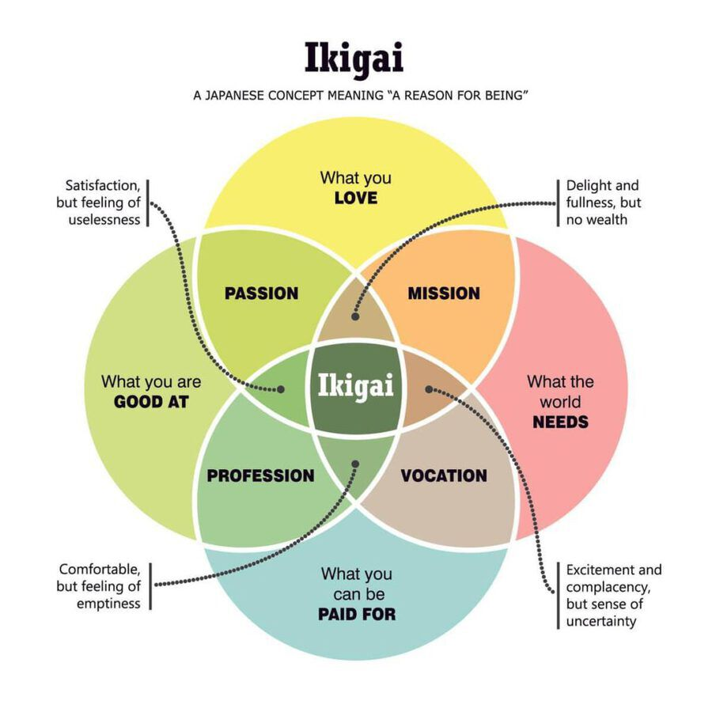

fonte: [twitter](https://twitter.com/tracheopteryx/status/1473314953713045507)

---

##### 1

Fazer o salto para trabalhar para um DAO pode ser um desafio.

Ajudei dezenas de novatos no espaço nos últimos 18 meses e o que geralmente é mais difícil para eles é esta pergunta simples:

"O que eu devo fazer?" 🤔

Aqui está um fio sobre como descobrir isso:

---

##### 2

Em um DAO real, o trabalho acontece de forma diferente.

É como a diferença entre um robô e uma ameba – DAOs são como tigelas de aminoácidos esperando que algum ribossomo venha e os empilhe em proteínas, não como um servomotor cuidadosamente projetado aguardando seu impulso elétrico predefinido.

---

##### 3

E não há cursos universitários sobre como ser um ribossomo DAO (ainda).

Você está na sopa, e precisa descobrir o que fazer com muito pouca orientação. É realmente como o que Yoda disse.

Sofremos centenas de anos de informações distorcidas para construir a ideia de uma "ética de trabalho"...  

---

##### 4

... a fim de entorpecer nossos instintos, enganando-nos a pensar que nossas vidas são melhor gastas como escravos assalariados.

A maioria de nós está tão divorciada da conexão com nossas próprias necessidades e desejos internos que é quase impossível responder à pergunta "o que eu realmente quero?"

---

##### 5

E, por mais estranho que pareça, essa é a pergunta que os DAOs precisam que respondamos.

Porque, como a biologia, os DAOs confiam em cada um de nós seguindo nossa própria sabedoria. Cada componente de um DAO precisa ser capaz de decidir por si mesmo o que fazer através do autoconhecimento e da percepção em tempo real do todo.

---

##### 6

Esta não é uma "organização horizontal". Este conceito não funciona. A hierarquia é uma característica essencial da nossa realidade (o sol é maior que a terra, supere isso).

O importante é uma hierarquia fluida onde o líder é quem sabe o que fazer a seguir. (E também processo e estrutura.)

---

##### 7

Voltando ao que fazer, criei este diagrama baseado no conceito japonês de Ikigai, adaptando-o para ser centrado em DAO, embora a maior parte seja a mesma.

Vou percorrer cada círculo.

<table><tr>
<td>  </td>
<td>  </td>
</tr></table>

---

##### 8

👉 What the 𝔻𝔸𝕆 ℕ𝔼𝔼𝔻𝕊

Qualquer coisa neste círculo é valiosa para o DAO. Verifique problemas no github, quadros de recompensas, páginas do Notion, canais do Discord ou quaisquer outros recursos que o DAO tenha para revelar o trabalho necessáro.

Encontre algum trabalho que chame sua atenção e faça-o.

---

##### 9

👉 What You Can Be ℙ𝔸𝕀𝔻 𝔽𝕆ℝ

Nem todas as contribuições têm o mesmo valor. Se você pode ganhar $ 1.000/h como designer de logotipo, em geral esse tipo de trabalho será de maior utilidade para o DAO do que algo pelo qual você não pode ser pago muito.

Mas esse não é o único fator.

---

##### 10

👉 What You 𝕃𝕆𝕍𝔼

Talvez você seja pago muito bem por logotipos, mas se você odeia fazê-los, é provável que eles não sejam tão bons e, além disso, você não fique por muito tempo.

A vida é muito curta para não fazer o que você ama. E o trabalho feito com amor é sempre mais forte.

---

##### 11

👉 What You Are 𝔹𝔼𝕊𝕋 𝔸𝕋

Uma das grandes alegrias do mundo é trabalhar com colegas brilhantes. Imagine como seria se cada um de nós fizesse o que somos melhores?

(Não preciso imaginar, contribuo em [@iearnfinance](https://twitter.com/iearnfinance) e [@coordinape](https://twitter.com/coordinape))

---

##### 12

Precisamos começar a pensar na perspectiva do DAO.

Que trabalho será de maior valor para o DAO?

Como posso ser mais útil?

Tudo no círculo "o que o DAO precisa" é valioso, mas são as áreas vermelhas que serão mais valiosas. E no meio é onde a mágica acontece.

---

##### 13

Não precisamos fazer mais gigantes FAANG. O mundo honestamente não pode sobreviver a isso. DAOs podem ser algo diferente.

Trabalhar pode ser uma /alegria/ não um fardo. A compensação pode ser um presente, não uma competição. E talvez 'corporações' possam parecer florestas, não lotes industriais.

---

##### 14

Não é tão difícil imaginar se cada um de nós fizer apenas o trabalho que amamos, que fazemos melhor, que podemos ser pagos e que nossos DAOs precisam.

Se não é isso, por que fazer?

/end

