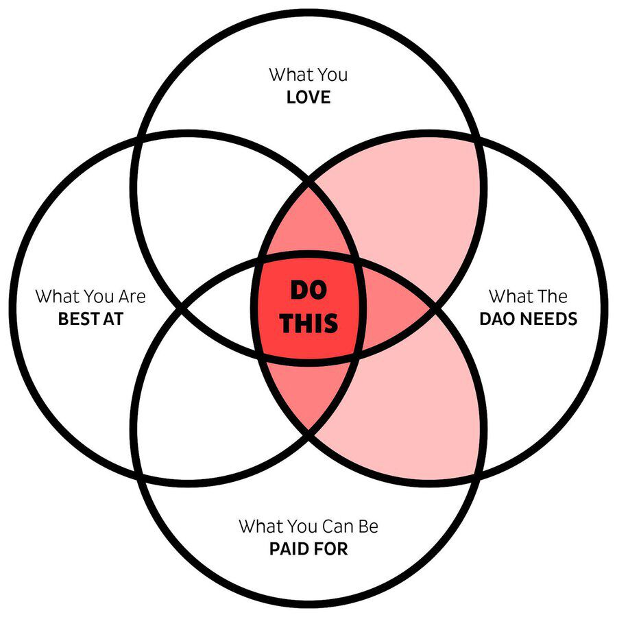
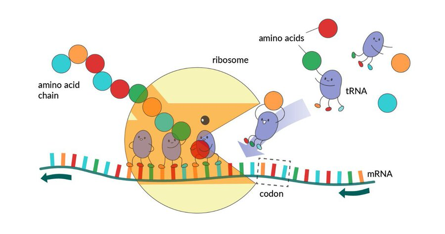
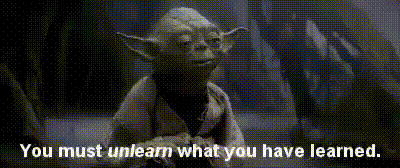
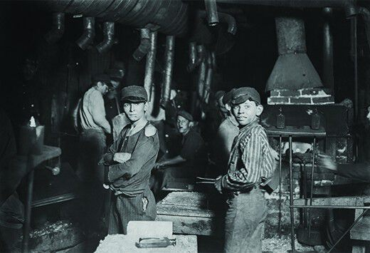
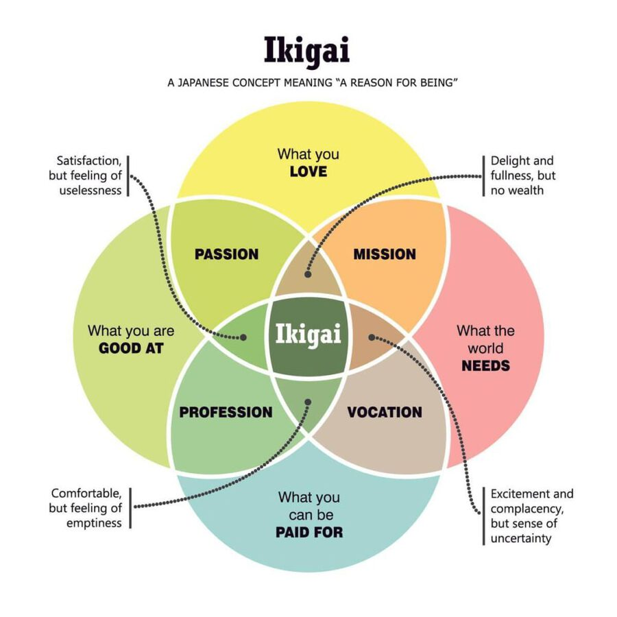
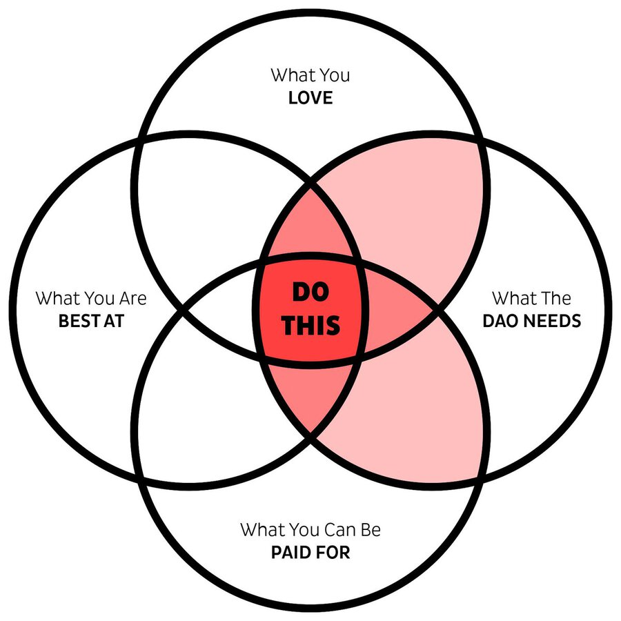

Orjinal kaynak: [twitter](https://twitter.com/tracheopteryx/status/1473314953713045507)

---

##### 1

Bir DAO için çalışmaya atılmak zor olabilir.

Geçtiğimiz 18 ay boyunca düzinelerce aceminin sahaya girmesine yardım ettim ve onlar için genellikle en zor olan şey şu basit soru:

"Ne yapmalıyım?" 🤔

İşte bunu nasıl çözeceğinize dair bir basamak:

---

##### 2

Gerçek bir DAO'da çalışmak farklı şekilde gerçekleşir.

Bu, bir robot ile bir amip arasındaki fark gibidir - DAO'lar, önceden ayarlanmış elektriksel darbeyi bekleyen dikkatlice tasarlanmış bir servo motor gibi değil, bir miktar ribozomun gelip onları proteinlere yığmasını bekleyen amino asit kaseleri gibidir.

---

##### 3

Ve nasıl bir DAO ribozomu olunacağına dair kolej eğitimleri yok (henüz).

Çorbanın içindesiniz ve çok az rehberlikle ne yapacağınızı bulmanız gerekiyor. Gerçekten Yoda'nın dediği gibi.

Bir "iş etiği" fikrini inşa etmek için yüzlerce yıldır gaslighting'in acısını çektik ...  

---

##### 4

... içgüdülerimizi uyuşturmak için, hayatımızın en iyi ücretli köleler olarak geçirileceğini düşünmemizi sağlamak için.

Çoğumuz kendi içsel ihtiyaçlarımız ve arzularımızla olan bağlantımızdan o kadar koptuk ki, "gerçekten ne istiyorum?" sorusuna cevap vermek neredeyse imkansız.

---

##### 5

Ve ne kadar garip görünse de, DAO'ların yanıtlamamızı istediği soru bu.

Çünkü, biyoloji gibi, DAO'lar da kendi bilgeliğimizi takip ederek her birimize güvenir. Bir DAO'nun her bir bileşeni, kendini bilme ve bütünün gerçek zamanlı olarak algılanması yoluyla ne yapacağına kendisi karar verebilmelidir.

---

##### 6

Bu, konseptin işlemediği bir "düz organizasyon" değildir. Hiyerarşi, realitemizin temel bir özelliğidir (güneş dünyadan daha büyüktür, üstesinden gelin).

Önemli olan, liderin daha sonra ne yapacağını bilen kişi olduğu akıcı hiyerarşidir. (Ve süreç ve yapı.)

---

##### 7

Ne yapılacağına geri dönersek, bu diyagramı Japonların İkigai konseptine dayalı olarak oluşturdum ve çoğu aynı olmasına rağmen onu DAO merkezli olacak şekilde uyarladım.

Her dönemden geçeceğim.

<table><tr>
<td>  </td>
<td>  </td>
</tr></table>

---

##### 8

👉 DAO’nun neye İHTİYACI VAR

Bu çemberdeki her şey DAO için değerlidir. Github sorunlarını, ödül panolarını, fikir sayfalarını, anlaşmazlık kanallarını veya DAO'nun ihtiyaç duyulan işi ortaya çıkarmak için sahip olduğu diğer kaynakları kontrol edin.

Size çağırışım yapan bir iş bulun ve onu yapın.

---

##### 9

👉 Ne Yaparsan ÖDEME ALIRSIN

Tüm katkılar eşit değerde değildir. Bir logo tasarımcısı olarak saatte 1000$ kazanabiliyorsanız, o zaman genel olarak bu tür işler DAO'ya çok fazla para alamayacağınız bir şeyden daha fazla hizmet edecektir.

Ama tek faktör bu değil.

---

##### 10

👉 Ne SEVİYORSUN

Belki logolar için bankadan para alıyorsunuz, ancak onları yapmaktan nefret ediyorsanız, muhtemelen o kadar iyi olmayacaklar ve dahası, uzun süre kalmayacaksınız.

Hayat sevdiğin şeyi yapmamak için çok kısa. Ve sevgiyle yapılan iş her zaman daha güçlüdür.

---

##### 11

👉 Hangi işte ÇOK İYİSİN

Dünyanın en büyük zevklerinden biri, parlak meslektaşlarla çalışmaktır. Her birimiz en iyi olduğumuz şeyi yaparsak nasıl olacağını hayal edin?

(Hayal etmeme gerek yok, [@iearnfinance](https://twitter.com/iearnfinance) ve [@coordinape](https://twitter.com/coordinape)'eye katkıda bulunuyorum.)

---

##### 12

DAO'nun perspektivinden düşünmeye başlamalıyız.

Hangi iş DAO için en kadar değerli olacak?

En çok nasıl hizmet edebilirim?

"DAO'nun ihtiyaç duyduğu şey" çemberindeki her şey değerlidir, ancak en değerli olacak olanlar kırmızı alanlardır. Ve tam arası, sihrin gerçekleştiği yerdir.

---

##### 13

Daha fazla FAANG devi yapmamıza gerek yok. Dürüst olmak gerekirse, dünya buna dayanamaz. DAO'lar farklı bir şey olabilir.

Çalışmak /sevinç olabilir/ yük değil. Mükafat bir hediye olabilir, rekabet değil. Ve belki 'şirketler' endüstriyel arsalar değil, ormanlar gibi hissedebilir.

---

##### 14

Her birimizin sadece sevdiğimiz, en iyi olduğumuz, parasını alabileceğimiz ve DAO'larımızın ihtiyaç duyduğu işi yapıp yapmadığımızı hayal etmek o kadar da zor değil.

Eğer öyle değilse, neden yapılsın?

/son
